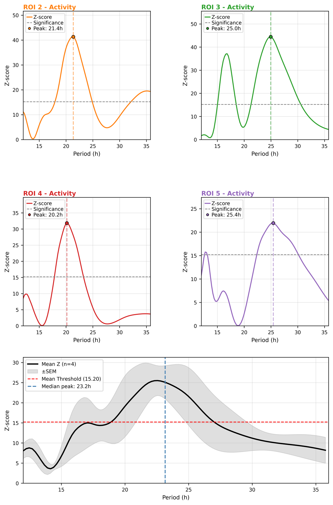
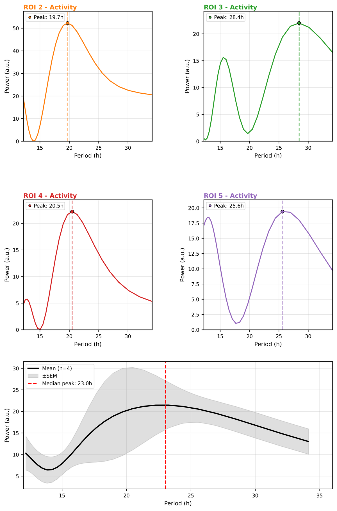
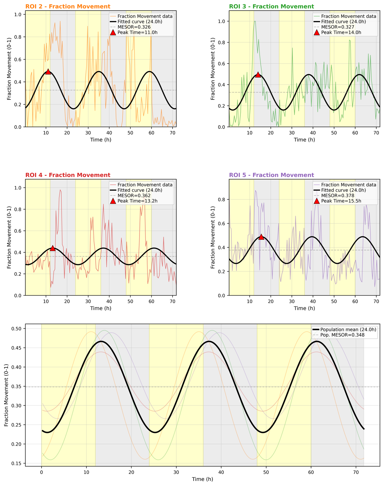
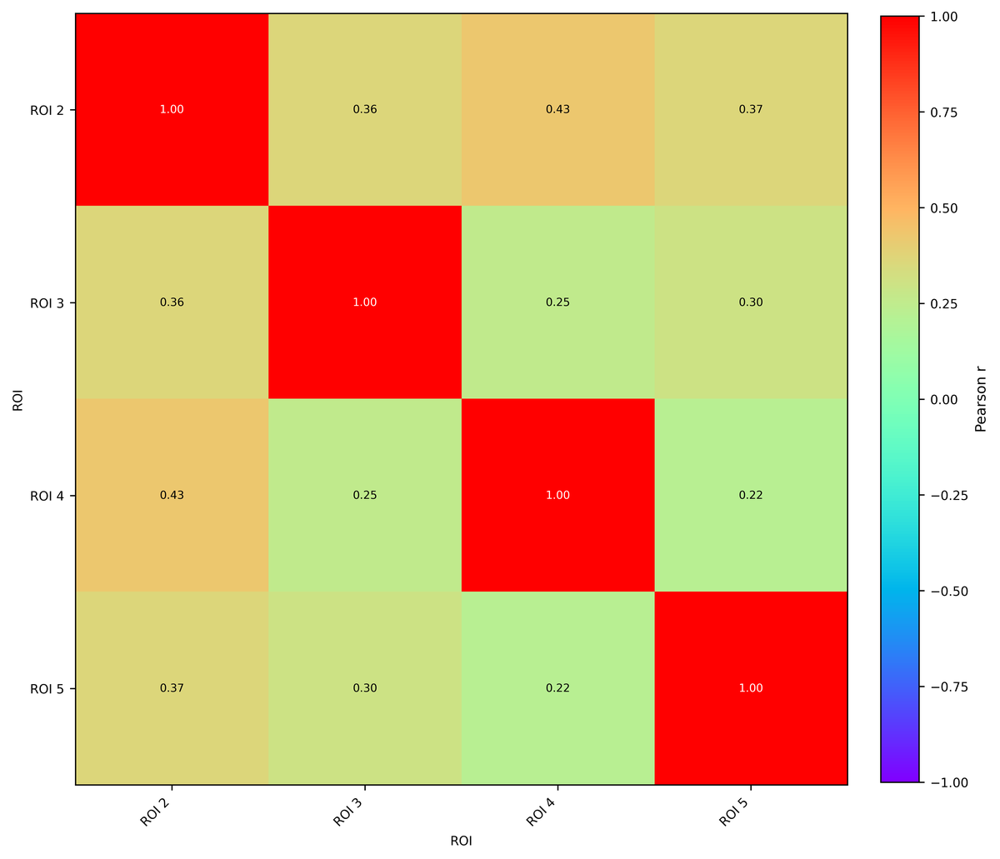
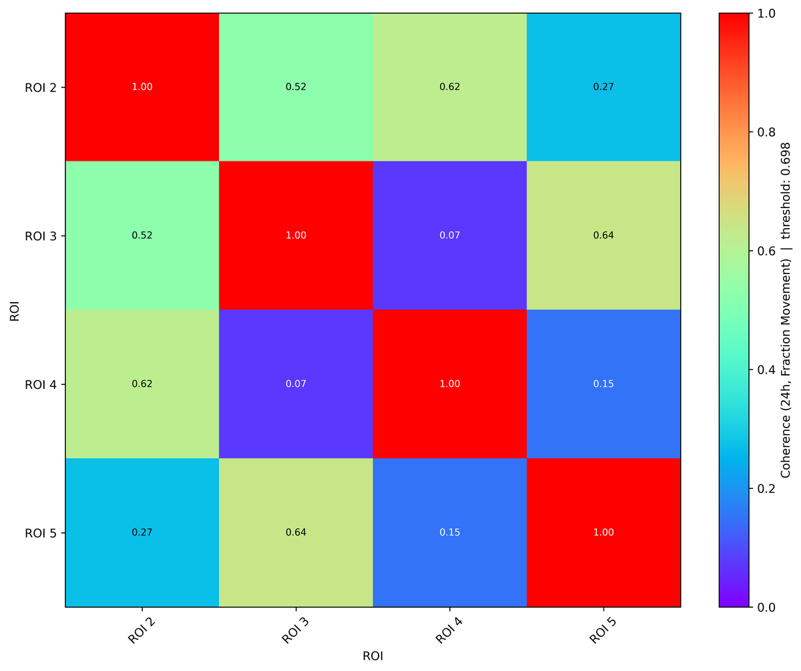
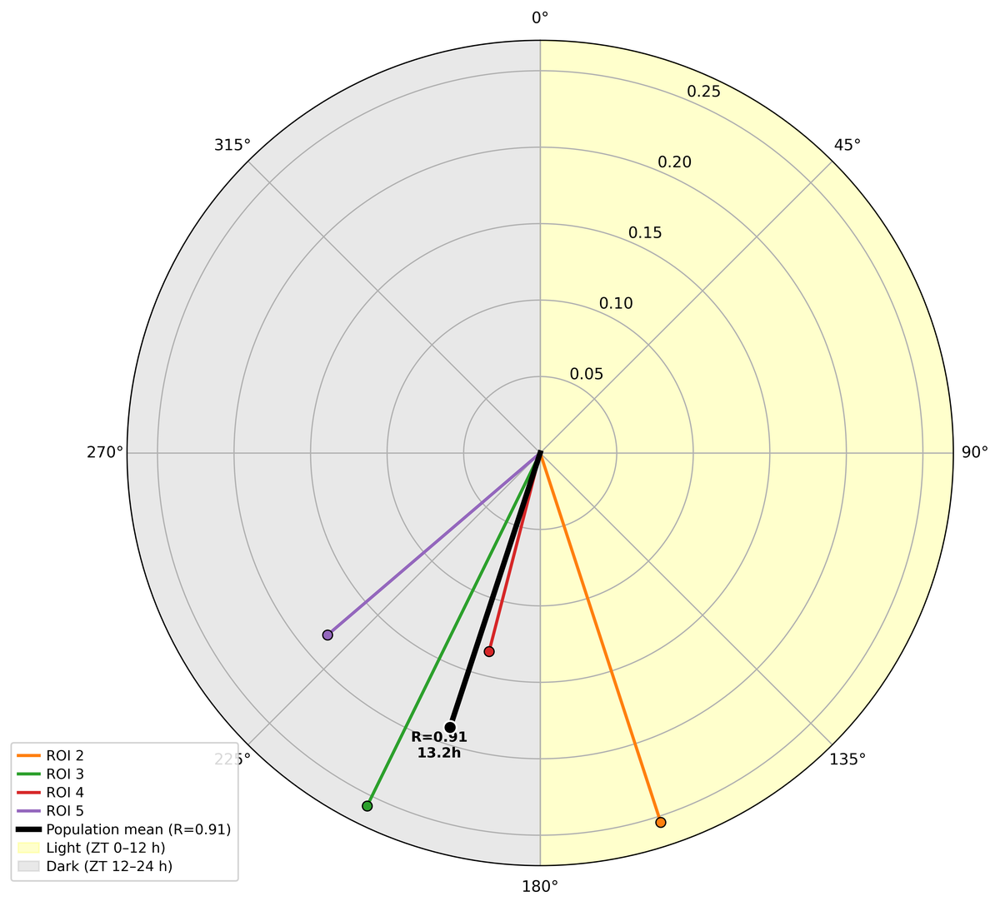

# Extended Analysis Documentation

## Table of Contents
1. [Overview](#overview)
2. [Fisher/Chi² Periodogram](#fisherchi-periodogram)
3. [FFT Power Spectrum](#fft-power-spectrum)
4. [Cosinor Analysis](#cosinor-analysis)
5. [ROI Similarity Matrix](#roi-similarity-matrix)
6. [Coherence Analysis](#coherence-analysis)
7. [Phase Clustering](#phase-clustering)
8. [Interpreting Results](#interpreting-results)
9. [Export Functionality](#export-functionality)
10. [Color Consistency](#color-consistency)
11. [Best Practices](#best-practices)

---

## Overview

The Extended Analysis tab provides six complementary methods for analyzing rhythmic patterns and synchronization in activity data. These methods are designed to detect circadian rhythms, ultradian cycles, and behavioral coordination across multiple ROIs.

### Motivation and Scientific Rationale

**Why Extended Analysis?**

Traditional movement analysis (tracking when animals move) answers the question "how much" but misses the critical question of "when" - the temporal organization of behavior. Many biological processes are inherently rhythmic:

1. **Circadian Clocks are Fundamental**
   - Nearly all organisms have internal ~24-hour clocks
   - Disrupted rhythms indicate disease, stress, or aging
   - Drug effects often manifest as rhythm changes before gross behavioral changes
   - Basic movement metrics (total activity) can be identical between rhythmic and arrhythmic animals

2. **Social Coordination Requires Temporal Analysis**
   - Two animals with identical total activity may be completely synchronized or completely independent
   - Dominance hierarchies manifest as sequential (lag-based) activity patterns
   - Competition appears as anti-phase relationships (one active while other rests)
   - Simple correlation misses these timing-dependent relationships

3. **Multiple Methods Provide Complementary Information**
   - No single method captures all aspects of rhythmic behavior
   - Statistical validation (Fisher) confirms what spectral analysis (FFT) reveals
   - Synchronization (Similarity, Coherence) explains relationships between rhythms
   - Phase analysis (Phase Clustering) quantifies precise timing and clock strength
   - Cross-validation between methods ensures robust, reproducible findings

**Real-World Example:**

Consider two experimental groups with identical mean activity levels (30% movement):

**Group A (Rhythmic):**
- Strong 24h circadian rhythm (Fisher: p < 0.0001)
- All animals synchronized (Similarity: r > 0.9)
- Robust circadian clock (Phase Clustering: high R_roi)
- **Interpretation**: Healthy, entrained animals with intact circadian systems

**Group B (Arrhythmic):**
- No significant rhythms (Fisher: p > 0.5)
- No synchronization (Similarity: r < 0.3)
- Weak/absent circadian clock (Phase Clustering: low R_roi)
- **Interpretation**: Disrupted circadian system (disease model, SCN lesion, or environmental stress)

**Standard movement analysis cannot distinguish these groups** - both show 30% activity. Extended Analysis reveals the critical difference: temporal organization.

### When to Use Extended Analysis

- **Circadian Research**: Detect 24-hour activity cycles and assess circadian clock function
- **Ultradian Rhythms**: Identify shorter cycles (e.g., feeding patterns, 3-12 hour rhythms)
- **Social Behavior**: Analyze synchronization, dominance hierarchies, and social coordination
- **Sleep/Wake Patterns**: Characterize activity phase relationships and sleep architecture
- **Drug Effects**: Compare rhythmic patterns before/after treatment (rhythm changes precede behavior changes)
- **Disease Models**: Assess circadian disruption in neurological disorders, aging, metabolic syndrome
- **Environmental Studies**: Measure entrainment to light/dark cycles, temperature, feeding schedules
- **Chronobiology**: Investigate free-running periods, phase shifts, and zeitgeber effects

### Analysis Methods Summary

| Method | Purpose | Best For | Output |
|--------|---------|----------|--------|
| Fisher/Chi² Periodogram | Statistical period detection | Confirming significant rhythms | Chi² statistic (labeled Z-score), Bonferroni-corrected p-values |
| FFT Power Spectrum | Frequency-domain analysis | Identifying all periodic components | Power spectrum (|FFT|², a.u.), permutation p-values |
| Cosinor Analysis | Rhythm quantification | Measuring amplitude, phase, MESOR | Fitted curves, confidence intervals, Nelson F-test for population |
| ROI Similarity | Cross-correlation analysis | Finding synchronized ROIs | Correlation matrix, clusters (Bonferroni-corrected) |
| Coherence Analysis | Frequency-specific synchronization | Identifying shared rhythms | Coherence heatmap (Bonferroni-corrected) |
| Phase Clustering | Per-ROI peak-activity time + population synchrony | Detecting activity phases and group coherence | Polar plot with per-ROI mean phase, R_roi ∈ [0,1] and population R_pop |

### Method Comparison: Strengths and Limitations

| Feature | Chi² Periodogram | FFT | Cosinor | ROI Similarity | Coherence | Phase Clustering |
|---------|-----------------|-----|---------|----------------|-----------|------------------|
| **Primary Output** | Z(T) statistic; Bonferroni-corrected | Power spectrum (|FFT|², a.u.) | MESOR, Amplitude, Acrophase | Correlation matrix | Coherence values | Per-ROI phase + R_roi, population R_pop |
| **Statistical Testing** | ✅ Yes (p-values) | ✅ Yes (permutation, 1000 shuffles) | ✅ Yes (p-values, CIs) | ✅ Yes (t-test + Bonferroni) | ✅ Yes (per-pair Bonferroni) | ❌ No (descriptive only) |
| **Exploratory Analysis** | ⚠️ Limited | ✅ Excellent | ❌ Poor | ✅ Good | ⚠️ Moderate | ❌ Poor |
| **Computational Speed** | ⚠️ Slow | ✅ Very fast | ✅ Fast | ⚠️ Moderate | ⚠️ Slow | ✅ Fast |
| **Data Requirements** | ≥3 cycles | ≥2 cycles | ≥2 cycles | ≥2 cycles | ≥5 segments | ≥2 cycles |
| **Finds Periods** | ✅ Yes | ✅ Yes | ✅ Yes (multi-period) | ❌ No | ❌ No | ❌ No |
| **Phase Information** | ❌ No | ❌ No | ✅ Yes (Acrophase) | ✅ Yes (via lag) | ❌ No | ✅ Yes |
| **Handles Mixed Periods** | ✅ Yes | ✅ Yes | ⚠️ Tests multiple | ❌ Poor | ⚠️ Moderate | ❌ No |
| **Multiple Rhythms** | ⚠️ Dominant only | ✅ All shown | ⚠️ Tests separately | ❌ N/A | ✅ All shown | ❌ Single period |
| **Noise Robustness** | ✅ Good | ⚠️ Moderate | ✅ Good | ⚠️ Moderate | ✅ Good | ⚠️ Moderate |
| **Interpretation** | ✅ Clear (Bonferroni threshold) | ⚠️ Requires permutation | ✅ Intuitive (parameters) | ✅ Intuitive | ⚠️ Complex | ✅ Visual |
| **Rhythm Quantification** | ❌ No | ⚠️ Indirect (power) | ✅ Direct (Amp, MESOR) | ❌ No | ⚠️ Indirect | ⚠️ Amplitude only |

### Quick Decision Guide

**Choose Chi² Periodogram when:**
- You need statistical significance testing with Bonferroni correction built in
- Confirming expected rhythms (hypothesis-driven research)
- Comparing rhythm strength across experimental conditions
- Data quality is moderate (method is noise-robust)

**Choose FFT Power Spectrum when:**
- Exploring unknown rhythms (no prior period expectation)
- Need to see all frequency components at once
- Fast screening of many ROIs required
- Identifying harmonics and secondary periods

**Choose ROI Similarity when:**
- Finding which animals are synchronized
- Detecting social groups or behavioral clusters
- Identifying phase-shifted (anti-phase) relationships
- All ROIs have similar periods

**Choose Coherence Analysis when:**
- Need frequency-specific synchronization measure
- Validating similarity matrix findings
- ROIs share rhythm at specific frequency but differ otherwise
- Detecting harmonic coupling

**Choose Phase Clustering when:**
- Need precise timing of activity peaks
- Measuring circadian clock strength (not just presence)
- Visualizing phase relationships for publication
- All ROIs confirmed to share same period (from Chi²/FFT)

### Recommended Workflow

**Standard Analysis Pipeline:**
1. **Chi² Periodogram or FFT** → Detect periods and confirm rhythms exist
2. **Cross-validate** → Both methods should agree on period (±1 hour)
3. **ROI Similarity** → Identify synchronized groups (Bonferroni-corrected)
4. **Coherence** (optional) → Verify frequency-specific synchronization
5. **Phase Clustering** → Descriptive timing relationships using confirmed period

**Exploratory Pipeline:**
1. **FFT** → Quick scan for any rhythms
2. **Chi² Periodogram** → Bonferroni-corrected statistical confirmation
3. **ROI Similarity** → Look for clusters and relationships
4. **Phase Clustering** → Descriptive timing analysis

**Troubleshooting Pipeline:**
- If Fisher finds rhythm but FFT doesn't → Check data quality, harmonics
- If Similarity shows grouping but Coherence doesn't → Different rhythm components
- If Phase Clustering shows odd results → Verify period consistency first

---

## Fisher/Chi² Periodogram

!!! info "At a glance"
    **Output:** χ² statistic Z(T) per tested period + a Bonferroni-corrected significance threshold (≈ 15.2).

    **Use for:** confirming a hypothesized rhythm (e.g. 24 h) with rigorous, correction-built-in statistics.

### What It Does

The Fisher/Chi² periodogram (Sokolove & Bushell 1978) is a statistical method for detecting periodic patterns in time-series data. It tests whether activity follows a rhythmic pattern by correlating the signal with sine and cosine waves at different candidate periods. The method provides formal statistical significance testing with a Bonferroni-corrected threshold.

### How It Works

1. **Reference Signal Construction**: For each candidate period T, construct orthogonal cosine and sine reference signals at angular frequency ω = 2π/T
2. **Correlation Analysis**: Calculate Pearson correlation between the data and each reference signal
3. **Squared Coherence**: Combine correlations to measure variance explained by the harmonic
4. **Z-Score Calculation**: Transform to a test statistic with known null distribution
5. **Significance Testing**: Compare to chi-square distribution (df=2) for p-values

??? note "Mathematical details"

    **Step 1: Correlation with Reference Signals**

    For each candidate period T with angular frequency ω = 2π/T, compute Pearson correlations:

    ```
    r_cos = Σᵢ(xᵢ - x̄)(cos(ωtᵢ) - cos̄) / √[Σᵢ(xᵢ - x̄)² × Σᵢ(cos(ωtᵢ) - cos̄)²]

    r_sin = Σᵢ(xᵢ - x̄)(sin(ωtᵢ) - sin̄) / √[Σᵢ(xᵢ - x̄)² × Σᵢ(sin(ωtᵢ) - sin̄)²]
    ```

    These correlations measure how well the data aligns with cosine and sine waves at the test period. Both components are needed because a sinusoid of arbitrary phase can be expressed as a linear combination: A·cos(ωt + φ) = A·cos(φ)·cos(ωt) - A·sin(φ)·sin(ωt).

    **Step 2: Squared Coherence (R²)**

    The squared coherence represents the proportion of variance explained by a sinusoid at period T:

    ```
    R²(T) = r_cos² + r_sin²
    ```

    This ranges from 0 (no periodic component) to ~1 (perfect sinusoidal fit). The sum of squared correlations arises because cosine and sine are orthogonal basis functions—their independent contributions to explained variance are additive.

    **Step 3: Chi-Squared Test Statistic**

    Convert R² to a test statistic with known null distribution:

    ```
    Z(T) = n × (r_cos² + r_sin²)
    ```

    where n is the number of observations. **Note:** The y-axis in the plot is labeled "Z-score" but the quantity plotted is actually the chi-squared statistic Z(T), which directly follows χ²(df=2) under the null hypothesis.

    **Step 4: Statistical Significance**

    Under H₀ (no periodic component at frequency ω), Z(T) follows a **chi-square distribution with 2 degrees of freedom**. The 2 df correspond to the two free parameters: the cosine coefficient and sine coefficient (equivalently, amplitude and phase).

    This distributional result derives from: under H₀, √n·r_cos and √n·r_sin are asymptotically independent standard normal variables, and the sum of squares of two independent standard normals follows χ²₂.

    **Bonferroni correction (m = 100 tested periods):**

    The plugin tests m = 100 candidate periods simultaneously. Without correction, α = 0.05 over 100 tests produces ~5 false positives on average. The Bonferroni-corrected threshold is:

    ```
    threshold = χ²(1 − α/m, df=2) ≈ 15.2    (for α = 0.05, m = 100)
    ```

    `is_significant` is set to True when Z(T) > 15.2 — **not** when a raw per-test p-value < 0.05.

    The "mean threshold" line on the population plot also shows this Bonferroni-corrected value.

    **p-value calculation (closed form for χ²₂):**
    ```
    p = 1 - F_χ²₂(Z) = e^(-Z/2)
    ```

    The second equality uses the closed-form CDF of chi-square with 2 degrees of freedom. Reported p-values are per-test (not corrected); significance decisions use the Bonferroni threshold on Z(T).

### Parameters

- **Minimum Period**: Shortest cycle to test (default: 12.0 hours)
- **Maximum Period**: Longest cycle to test (default: 36.0 hours)
- **Significance Level**: Statistical threshold (default: 0.05 = 95% confidence)
- **Bin Size**: Optional data averaging (seconds)

### Output Interpretation



*Example Chi² periodogram output: per-ROI Z(T) with the Bonferroni threshold (≈ 15.2) and the population mean (real *Nematostella* recording, 4 ROIs).*

#### Chi² Statistic Plot

**Note:** The y-axis is labeled "Z-score" in the plot, but the quantity displayed is the chi-squared statistic Z(T) = n × (r_cos² + r_sin²), which follows χ²(df=2) under H₀.

- **Blue curve**: Chi-squared statistic Z(T) across all tested periods
- **Gray dashed line**: Bonferroni-corrected significance threshold (≈ 15.2 for α=0.05, m=100)
- **Colored vertical line**: Dominant period (if significant)
- **Colored marker**: Peak Z(T) value

#### Statistical Metrics
- **Dominant Period**: Period with highest Z(T) (hours)
- **Z(T) value**: Strength of rhythm (higher = stronger); labeled "Z-score" in output
- **p-value**: Per-test p = e^(-Z/2); significance decision uses Bonferroni threshold
- **Critical Z**: Bonferroni-corrected threshold ≈ 15.2 (for α=0.05, m=100 periods)

#### What Values Mean

| Z(T) value | Bonferroni significant | Interpretation |
|------------|----------------------|----------------|
| > 20 | Yes | Very strong, highly significant rhythm |
| 15-20 | Yes (near threshold) | Significant rhythm |
| 6-15 | No (below threshold) | Weak or marginal rhythm; not significant after correction |
| < 6 | No | No significant rhythm |

### Example Results

```
ROI 1:
  ✓ Significant circadian rhythm detected (Z=125.45 > threshold 15.2)
  Dominant period: 24.12 hours
  Z(T): 125.45  (p = e^(-125.45/2) ≈ 0)
```

**Interpretation**: This ROI shows a very strong 24-hour rhythm. The chi-squared statistic (125.45) far exceeds the Bonferroni-corrected threshold (≈ 15.2), confirming significance with extremely high confidence.

### Advantages

✅ **Statistical Rigor**
- Provides p-values for objective significance testing
- Chi-square distribution (df=2) is well-established
- Clear yes/no answer: rhythm is significant or not

✅ **Hypothesis Testing**
- Specifically tests for periodicity at each frequency
- Ideal for confirming expected rhythms (e.g., "is there a 24h rhythm?")
- Robust against noise with sufficient data

✅ **Interpretability**
- Z-scores are intuitive (higher = stronger rhythm)
- Direct biological interpretation
- Easy to report in publications

✅ **Sensitivity**
- Can detect weak rhythms with sufficient data
- Works well even with moderate noise levels
- Effective for irregular waveforms (non-sinusoidal)

### Limitations

⚠️ **Computational Cost**
- Slower than FFT for large datasets
- Tests each period individually (100 periods = 100 tests)
- Multiple comparison problem is handled by Bonferroni correction (threshold ≈ 15.2 instead of 5.99)

⚠️ **Data Requirements**
- Requires ≥3 complete cycles for statistical power
- Short recordings may not reach significance
- Minimum ~10 samples needed per test

⚠️ **Resolution**
- Period resolution depends on tested range and number of test periods
- Cannot provide finer resolution than ~1% of period
- May miss periods outside predefined range

⚠️ **Assumptions**
- Assumes stationary rhythm (consistent throughout recording)
- Cannot detect transient or changing rhythms
- Sensitive to long-term trends (requires detrending)

⚠️ **Multiple Rhythms**
- Reports only dominant period
- May miss secondary rhythms
- Harmonics can complicate interpretation

### When to Use

**Best For:**
- Confirming hypothesized rhythms (e.g., circadian studies)
- Publication-quality statistical validation
- Comparing rhythm strength across conditions
- Detecting rhythms in noisy data

**Not Ideal For:**
- Exploratory analysis (use FFT instead)
- Very short datasets (< 3 cycles)
- Rapidly changing rhythms
- Identifying all frequency components simultaneously

### Best Practices

1. **Data Duration**: Need at least 3 complete cycles for reliable detection
   - For 24h rhythms: minimum 72 hours of data
   - For 12h rhythms: minimum 36 hours of data

2. **Period Range**: Set based on expected rhythms
   - Circadian: 20-28 hours
   - Ultradian: 2-12 hours
   - Custom ranges for specific research questions

3. **Binning**: Use for high-resolution data
   - Raw data at 5-second intervals → bin to 60 seconds
   - Reduces noise while preserving rhythmic patterns

4. **Multiple Comparisons**: Bonferroni correction for m=100 periods is applied automatically
   - The significance threshold is χ²(1 − 0.05/100, df=2) ≈ 15.2
   - No manual correction is needed; `is_significant` already reflects this

---

## FFT Power Spectrum

!!! info "At a glance"
    **Output:** power spectrum (|FFT|², a.u.) across all frequencies + a permutation p-value.

    **Use for:** exploring unknown or multiple rhythms and harmonics across all frequencies at once.

### What It Does

Fast Fourier Transform (FFT) converts time-series data into the frequency domain, revealing all periodic components simultaneously. Unlike the Chi² periodogram which tests specific candidate periods, FFT provides a complete spectral decomposition that can reveal unexpected periodicities, harmonics, and the overall noise floor.

### How It Works

1. **Linear Detrending**: Removes baseline drift
2. **Windowing**: Applies Hann window to reduce spectral leakage
3. **Zero-Padding**: Pads signal 4× for better frequency resolution
4. **FFT Computation**: Calculates power spectrum
5. **Permutation Test**: Assesses statistical significance
6. **Peak Detection**: Identifies significant frequency peaks

??? note "Mathematical details"

    **Discrete Fourier Transform (DFT)**

    The DFT decomposes a time series x[n] of N samples into complex-valued frequency components:

    ```
    X[k] = Σₙ₌₀^(N-1) x[n] × e^(-i2πkn/N),    k = 0, 1, ..., N-1
    ```

    Each coefficient X[k] corresponds to frequency f_k = k/(N×Δt) Hz, where Δt is the sampling interval.

    **Power Spectral Density (PSD)**

    The PSD quantifies signal energy at each frequency:

    ```
    P[k] = |X[k]|² = Re(X[k])² + Im(X[k])²
    ```

    For real-valued signals, the spectrum is symmetric, so only frequencies up to the Nyquist frequency f_Nyq = 1/(2Δt) contain unique information.

    **Preprocessing Steps**

    **Linear Detrending**

    Biological time series often exhibit slow baseline drift. A linear trend produces a large DC component and spectral leakage into low frequencies, potentially masking circadian signals:

    ```
    x_detrended[n] = x[n] - (â×n + b̂)
    ```

    where â and b̂ are least-squares estimates of the linear trend.

    **Hann Windowing**

    The DFT assumes the signal is periodic with period N. Non-integer cycles cause spectral leakage—energy spreads into adjacent frequency bins. The Hann (raised cosine) window tapers the signal to reduce this:

    ```
    w[n] = 0.5 × (1 - cos(2πn/(N-1))),    n = 0, ..., N-1
    ```

    The Hann window provides ~32 dB sidelobe suppression with a good trade-off between frequency resolution and leakage reduction.

    **Zero-Padding**

    Native frequency resolution is Δf = 1/(N×Δt). Zero-padding—appending zeros before FFT—interpolates additional frequency bins, providing a smoother spectral estimate:

    ```
    N_FFT = 4 × N    (rounded to next power of 2 for computational efficiency)
    ```

    This improves apparent resolution by 4× without adding new information.

    **Statistical Significance (Permutation Test)**

    Unlike Fisher's Z, FFT power has no simple analytic null distribution. We use a non-parametric permutation test with 1000 shuffles:

    1. Compute observed **maximum** power P_obs over the full tested period range
    2. Generate N_perm = 1000 surrogate time series by randomly shuffling sample order (destroys temporal structure, preserves amplitude distribution)
    3. For each surrogate, apply same preprocessing and compute the **maximum** FFT power over the same period range
    4. Calculate the p-value with the Phipson & Smyth (2010) add-one correction:

    ```
    p = (b + 1) / (N_perm + 1),    where b = Σᵢ 𝟙[P_perm,i ≥ P_obs]
    ```

    Here 𝟙[·] is the indicator function and `b` counts the surrogates whose max-power matched or exceeded the observed max-power. The **+1** add-on treats the observed statistic as one draw from the discrete permutation null distribution and prevents the impossible-as-a-probability value p = 0 when no surrogate is more extreme (Phipson & Smyth, *SAGMB* 2010).

    Using the **maximum** power over the full period range (rather than power at a single frequency) correctly handles the multiple-comparisons problem inherent in scanning many frequencies. The p-value represents the probability that a shuffled (non-periodic) signal would produce as strong a spectral peak anywhere in the tested range. With 1000 permutations, the smallest achievable p-value is 1/(1000 + 1) ≈ 0.001.

### Parameters

- **Minimum Period**: Shortest cycle to analyze (hours)
- **Maximum Period**: Longest cycle to analyze (hours)
- **Window Function**: Type of windowing (default: "hann")
  - "hann": Good general-purpose window
  - "hamming": Similar to Hann, slightly different sidelobe properties
  - "blackman": Better frequency resolution, lower spectral leakage
- **Bin Size**: Optional data averaging

### Output Interpretation



*Example FFT power-spectrum output across the tested period range (real *Nematostella* recording).*

#### Power Spectrum Plot
- **Colored curve**: Power across all frequencies
- **Colored vertical line**: Dominant period
- **Colored marker**: Peak power value

#### Spectral Metrics
- **Dominant Period**: Period with maximum power (hours)
- **Dominant Power**: Strength at dominant frequency
- **Frequency Peaks**: List of all significant peaks (period, power)

#### Power Values

Power is in arbitrary units (AU²). Relative values matter more than absolute values:

| Relative Power | Interpretation |
|----------------|----------------|
| 10× higher than others | Very strong dominant rhythm |
| 2-5× higher | Clear rhythm |
| Similar to others | Weak or multiple competing rhythms |

### Comparison with Chi² Periodogram

| Feature | Chi² Periodogram | FFT |
|---------|-----------------|-----|
| Output | Bonferroni-corrected Z(T) statistic | Power spectrum (|FFT|², a.u.) |
| Strength | Tests specific hypotheses, built-in correction | Explores all frequencies simultaneously |
| Significance | Bonferroni-corrected threshold ≈ 15.2 | Permutation p-value (max-power test) |
| Use Case | Confirm expected rhythms with rigorous correction | Discover unknown rhythms |

**Agreement**: Both should identify the same dominant period. Typical differences:
- Chi² Periodogram: 24.0h
- FFT: 23.7-24.3h (slightly different due to frequency resolution)

Differences < 1 hour indicate excellent agreement.

### Advantages

✅ **Computational Efficiency**
- Very fast (O(N log N) algorithm)
- Analyzes all frequencies simultaneously
- Scales well to large datasets

✅ **Exploratory Power**
- Reveals all periodic components at once
- No need to specify expected periods in advance
- Identifies harmonics and secondary rhythms automatically

✅ **Standard Method**
- Widely used in signal processing
- Extensive literature and validation
- Compatible with other spectral analysis tools

✅ **Visual Clarity**
- Power spectrum shows full frequency content
- Easy to identify dominant peaks
- Reveals complex rhythmic structures

✅ **Resolution**
- Zero-padding provides excellent frequency resolution
- Can distinguish closely-spaced periods
- Continuous spectrum (not limited to discrete test periods)

### Limitations

⚠️ **Arbitrary Units**
- Power values are |FFT|² — arbitrary units (a.u.) that depend on signal amplitude and n
- Absolute power values are not comparable across recordings with different durations or amplitudes
- Use relative values (peak vs. background) and permutation p-values for interpretation

⚠️ **Spectral Leakage**
- Non-integer number of cycles causes frequency spreading
- Windowing reduces but doesn't eliminate leakage
- Can create artificial side lobes in spectrum

⚠️ **Harmonics Confusion**
- Strong fundamental generates harmonics (2×, 3× frequency)
- Harmonics can be mistaken for independent rhythms
- Example: 24h rhythm creates peaks at 12h, 8h, 6h

⚠️ **Amplitude Sensitivity**
- Assumes sinusoidal oscillations
- Non-sinusoidal waveforms spread power across frequencies
- Square waves or sharp transitions create many harmonics

⚠️ **Detrending Required**
- Very sensitive to linear trends
- DC component (zero frequency) can dominate spectrum
- Long-term drift must be removed

⚠️ **Edge Effects**
- Beginning and end of recording affect spectrum
- Windowing reduces but impacts amplitude estimates
- Very short recordings have poor frequency resolution

### When to Use

**Best For:**
- Exploratory analysis (unknown rhythms)
- Identifying multiple periodic components
- Comparing spectral signatures across conditions
- Fast screening of many ROIs
- Detecting harmonics and complex rhythms

**Not Ideal For:**
- When an analytic p-value is required (permutation test gives p-values but with minimum p = 0.001)
- When absolute power values are needed (units are arbitrary)
- Very short recordings with insufficient frequency resolution

### Best Practices

1. **Window Selection**:
   - Hann: Default, good for most cases
   - Blackman: Use for noisy data (better spectral leakage suppression)
   - Hamming: Similar to Hann, slightly different sidelobe properties
   - None: Only for very clean periodic signals with integer cycles

2. **Zero-Padding**: Automatically applied (4× padding)
   - Improves frequency resolution without adding information
   - Provides smooth interpolation between frequency bins
   - Does not increase statistical power

3. **Interpretation**:
   - Look for clear peaks above background noise floor
   - Multiple peaks may indicate harmonics (e.g., 24h and 12h, 8h, 6h)
   - Broad peaks suggest irregular or variable-period rhythms
   - Check if secondary peaks are harmonics (integer divisors of dominant)

4. **Validation**:
   - Always cross-validate with the Chi² periodogram
   - Both methods should agree on dominant period (±1 hour)
   - Use Chi² periodogram for Bonferroni-corrected statistical confirmation

---

## Cosinor Analysis

!!! info "At a glance"
    **Output:** MESOR, Amplitude and Acrophase with 95% CIs and an F-test (plus a population Nelson F-test).

    **Use for:** quantifying a known-period rhythm and comparing rhythm parameters between groups.

### What It Does

Cosinor analysis quantifies circadian rhythms by fitting a cosine curve to activity data and extracting key rhythmic parameters: MESOR (mean level), Amplitude (rhythm strength), and Acrophase (peak timing). This is the gold standard method in chronobiology for rhythm characterization.

??? note "Mathematical details"

    **The Cosinor Model**

    The single-cosinor model assumes activity follows a sinusoidal pattern:

    ```
    x(t) = M + A × cos(2πt/T + φ) + ε
    ```

    Where:
    - **M (MESOR)**: Midline Estimating Statistic Of Rhythm—the rhythm-adjusted mean level
    - **A (Amplitude)**: Half the peak-to-trough difference—rhythm strength
    - **φ (Acrophase)**: Phase angle at peak activity—timing within cycle
    - **T (Period)**: Duration of one complete cycle (e.g., 24h for circadian)
    - **ε**: Residual error (assumed i.i.d. normal)

    **Linearization for Least-Squares Estimation**

    Direct estimation of A and φ would require nonlinear optimization. Using the trigonometric identity cos(θ+φ) = cos(θ)cos(φ) - sin(θ)sin(φ), the model becomes linear:

    ```
    x(t) = β₀ + β₁×cos(ωt) + β₂×sin(ωt) + ε
    ```

    where ω = 2π/T, and:
    - β₀ = M (MESOR)
    - β₁ = A×cos(φ)
    - β₂ = -A×sin(φ)

    **Ordinary Least Squares (OLS) Estimation**

    Construct the n×3 design matrix:

    ```
    X = | 1   cos(ωt₁)   sin(ωt₁) |
        | 1   cos(ωt₂)   sin(ωt₂) |
        | ⋮      ⋮          ⋮     |
        | 1   cos(ωtₙ)   sin(ωtₙ) |
    ```

    The OLS estimator is:

    ```
    β̂ = (X'X)⁻¹X'x
    ```

    where x = [x(t₁), ..., x(tₙ)]' is the observation vector.

    **Parameter Recovery:**

    ```
    M = β̂₀
    A = √(β̂₁² + β̂₂²)
    φ = atan2(-β̂₂, β̂₁)
    ```

    The four-quadrant arctangent (atan2) correctly resolves phase to (-π, π] regardless of coefficient signs. Convert to clock time: t_acro = (φ/ω) mod T.

    **Significance Testing (F-test)**

    The null hypothesis H₀: A = 0 (no rhythm) is tested by comparing the full model to the mean-only model:

    ```
    F = [(SS_tot - SS_res)/k] / [SS_res/(n-k-1)] = [SS_model/2] / [SS_res/(n-3)]
    ```

    where:
    - SS_tot = Σᵢ(xᵢ - x̄)² — total sum of squares
    - SS_res = Σᵢ(xᵢ - x̂ᵢ)² — residual sum of squares
    - SS_model = SS_tot - SS_res — model sum of squares
    - k = 2 — number of model parameters (cos and sin coefficients)
    - n-3 — residual degrees of freedom

    Under H₀, F follows an F-distribution with (2, n-3) degrees of freedom.

    **Goodness of Fit:**

    ```
    R² = 1 - SS_res/SS_tot = SS_model/SS_tot
    ```

    R² represents the proportion of variance explained by the fitted sinusoid.

    **Confidence Intervals**

    Standard errors are computed from the variance-covariance matrix:

    ```
    Var(β̂) = σ̂² × (X'X)⁻¹,    where σ̂² = SS_res/(n-3)
    ```

    For MESOR: SE(M) = √Var(β̂₀)

    For Amplitude (nonlinear function), use the **delta method**:

    ```
    SE(A) ≈ (1/A) × √[β̂₁²×Var(β̂₁) + β̂₂²×Var(β̂₂)]
    ```

    Confidence intervals: θ ± t_{n-3,1-α/2} × SE(θ)

    **Population-Mean Cosinor (Nelson et al. 1979)**

    For multiple individuals (ROIs), the **population cosinor** uses the Nelson et al. (1979) F-test. Each individual ROI's OLS fit produces β_cos,j and β_sin,j. The population-level hypothesis H₀: mean(β_cos) = mean(β_sin) = 0 is tested with:

    ```
    F(dfn=2, dfd=2(n−1))
    ```

    where n = number of ROIs. The numerator is built from the mean β_cos and mean β_sin across all ROIs; the denominator uses the variance of those coefficients. This tests whether the population as a whole oscillates — not merely whether individual ROIs oscillate.

    Population amplitude and acrophase are derived via vector averaging of individual (Aⱼ, φⱼ):
    ```
    xⱼ = Aⱼ×cos(φⱼ),    yⱼ = Aⱼ×sin(φⱼ)
    x̄ = (1/J)Σⱼxⱼ,    ȳ = (1/J)Σⱼyⱼ
    A_pop = √(x̄² + ȳ²),    φ_pop = atan2(ȳ, x̄)
    ```

### Output Parameters



*Example cosinor output: fitted cosine curves overlaid on the activity data (real *Nematostella* recording).*

**Individual ROI Results:**
- **Best-fit period**: Period with highest R² among tested periods
- **MESOR**: Mean activity level (rhythm-adjusted baseline)
- **Amplitude**: Strength of rhythm (0 = no rhythm, higher = stronger)
- **Acrophase**: Time of peak activity (hours from recording start)
- **R²**: Goodness of fit (>0.3 = strong rhythm, 0.1-0.3 = moderate, <0.1 = weak)
- **p-value**: Statistical significance (p < 0.05 = significant rhythm)
- **95% Confidence Intervals**: Uncertainty ranges for each parameter

**Population Results:**
- **Population MESOR**: Average baseline activity across all ROIs
- **Population Amplitude**: Collective rhythm strength (vector-averaged)
- **Population Acrophase**: Common peak time across population
- **Proportion significant**: Percentage of ROIs with significant rhythms

### Interpretation Guide

#### MESOR (Midline Estimating Statistic of Rhythm)
- **What it means**: The rhythm-adjusted mean activity level
- **Typical values**: 0.0-1.0 (fraction movement data)
- **Interpretation**:
  - High MESOR (>0.5): Generally active organism
  - Low MESOR (<0.2): Generally inactive organism
  - MESOR ≠ simple mean (accounts for rhythmic variation)

#### Amplitude
- **What it means**: Half the distance between peak and trough
- **Typical values**: 0.0-0.5 for fraction movement
- **Interpretation**:
  - High amplitude (>0.2): Strong, robust circadian rhythm
  - Moderate amplitude (0.1-0.2): Detectable but weaker rhythm
  - Low amplitude (<0.1): Weak or absent rhythm
  - Amplitude = 0: Arrhythmic (constant activity level)

**Clinical relevance:**
- Aging typically reduces amplitude (rhythm fragmentation)
- SCN lesions eliminate amplitude (no circadian clock)
- Zeitgebers (light/dark) increase amplitude (entrainment)

#### Acrophase
- **What it means**: Time of peak activity within the cycle
- **Units**: Hours from start of recording
- **Interpretation**:
  - For 24h rhythm with lights on at t=0:
    - Acrophase = 8-12h: Diurnal (day-active)
    - Acrophase = 20-24h or 0-4h: Nocturnal (night-active)
  - Acrophase shift indicates:
    - Phase advance: Peak occurs earlier (e.g., jet lag west→east)
    - Phase delay: Peak occurs later (e.g., jet lag east→west)

**Group comparisons:**
- Synchronized population: Similar acrophases (low SD)
- Desynchronized population: Variable acrophases (high SD)
- Anti-phase relationship: Acrophases differ by ~12h (for 24h rhythm)

#### R² (Goodness of Fit)
- **What it means**: Proportion of variance explained by the cosine model
- **Scale**: 0.0-1.0
- **Interpretation**:
  - R² > 0.5: Excellent fit, very strong rhythm
  - R² = 0.3-0.5: Good fit, strong rhythm
  - R² = 0.1-0.3: Moderate fit, detectable rhythm
  - R² < 0.1: Poor fit, weak or no rhythm

**Why R² matters:**
- High R²: Activity closely follows cosine pattern (clean rhythm)
- Low R²: Activity deviates from cosine (ultradian, noise, or arrhythmic)
- Compare with p-value: significant but low R² = detectable but weak rhythm

#### p-value
- **What it tests**: Null hypothesis that amplitude = 0 (no rhythm)
- **Interpretation**:
  - p < 0.001 (***): Very strong evidence for rhythm
  - p < 0.01 (**): Strong evidence for rhythm
  - p < 0.05 (*): Significant rhythm detected
  - p ≥ 0.05 (ns): No significant rhythm

**Important notes:**
- Large sample sizes can yield p < 0.05 with low amplitude (biological significance ≠ statistical)
- Check R² and amplitude together with p-value
- Confidence intervals show precision of estimates

### When to Use Cosinor

**Ideal scenarios:**
- **Quantifying rhythm strength**: Need numeric amplitude and MESOR values
- **Comparing experimental groups**: Test if treatment affects rhythm parameters
- **Publication requirements**: Cosinor is the most widely accepted method in chronobiology
- **Known period**: Testing specific periods (e.g., 24h circadian rhythm)
- **Population studies**: Combining rhythms across multiple individuals
- **Phase response curves**: Measuring acrophase shifts after zeitgeber pulses

**Advantages:**
- Provides interpretable, quantitative parameters (MESOR, Amplitude, Acrophase)
- Statistical testing with p-values and confidence intervals
- Fast computation (least squares regression)
- Robust to moderate noise
- Standard method in chronobiology literature (easy comparison with published work)
- Population-level statistics available

**Limitations:**
- Assumes sinusoidal rhythm (cosine wave) - may miss complex waveforms
- Single-component model (doesn't detect multiple simultaneous rhythms like FFT)
- Requires ~2-3 complete cycles for reliable parameter estimation
- Less suitable for exploratory analysis (need to specify test periods)
- Cannot detect period if not in the tested range

### Practical Example

**Scenario**: Testing whether a mutation affects circadian rhythm strength

**Wildtype (WT) results:**
```
ROI 1:
  Best-fit period: 24.0 hours
  MESOR: 0.35 (moderate baseline activity)
  Amplitude: 0.25 (strong rhythm)
  Acrophase: 14.2 hours (peak in mid-afternoon)
  R²: 0.65 (good fit)
  p-value: 0.0001 (***)

Population:
  Amplitude: 0.23 (consistent across animals)
  All 6 ROIs significant (100%)
```

**Mutant results:**
```
ROI 1:
  Best-fit period: 24.0 hours
  MESOR: 0.34 (similar baseline to WT)
  Amplitude: 0.08 (weak rhythm - 3× lower than WT!)
  Acrophase: 16.5 hours (2h phase delay)
  R²: 0.18 (poor fit)
  p-value: 0.12 (ns)

Population:
  Amplitude: 0.06 (very weak)
  Only 2/6 ROIs significant (33%)
```

**Interpretation**: Mutation causes **circadian rhythm disruption**:
- Amplitude reduced by 68% (from 0.25 to 0.08)
- Most individuals show no significant rhythm (100% → 33%)
- MESOR unchanged (mutation affects clock, not overall activity)
- Acrophase variable (desynchronization)

**Conclusion**: Mutation impairs circadian clock function without affecting total activity levels. This would be **missed** by standard activity analysis but **clearly detected** by cosinor.

### Comparison with Other Methods

| Feature | Cosinor | Chi² Periodogram | FFT |
|---------|---------|-----------------|-----|
| **Primary Use** | Quantify rhythm parameters | Detect significant periods | Explore all frequencies |
| **Output** | MESOR, Amplitude, Acrophase | Z(T) with Bonferroni threshold; Nelson F for population | Power spectrum (|FFT|², a.u.) |
| **Best for** | Known periods, group comparisons | Period detection, Bonferroni-corrected testing | Exploratory analysis |
| **Speed** | Very fast | Slow | Very fast |
| **Statistics** | p-values + 95% CIs; Nelson F-test | Bonferroni-corrected Z(T) threshold | Permutation p-values (max-power test) |
| **Assumptions** | Sinusoidal rhythm | None (non-parametric) | Stationarity |

**Recommendation**: Use **Cosinor** for quantifying known rhythms (e.g., testing 24h circadian), **Chi² Periodogram** for detecting unknown periods with Bonferroni-corrected statistical validation, and **FFT** for broad exploratory analysis of all frequencies.

### Tips and Best Practices

1. **Period Selection**:
   - Test biologically relevant periods: 12h (ultradian), 24h (circadian), 30h (infradian)
   - Include period range based on recording duration
   - For free-running conditions, test 20-28h (circadian period may not be exactly 24h)

2. **Data Requirements**:
   - Minimum: 2 complete cycles (48h for circadian)
   - Recommended: ≥3 cycles (72h for circadian)
   - Longer recordings improve parameter precision (tighter confidence intervals)

3. **Interpreting Significance**:
   - **p < 0.05 but R² < 0.1**: Statistically detectable but biologically weak rhythm
   - **p ≥ 0.05 but R² > 0.2**: May be underpowered, try longer recording
   - **High amplitude with high p-value**: Check for outliers or bimodal rhythm

4. **Population Analysis**:
   - If <50% of individuals significant: population-level rhythm questionable
   - High variability in acrophases: desynchronized population
   - Use vector plots to visualize population phase distribution

5. **Validation**:
   - Always plot fitted curves over raw data (visual inspection critical)
   - Check that acrophase aligns with visible peaks
   - Compare results with Chi² periodogram or FFT for consistency

6. **Common Pitfalls**:
   - **Testing too many periods**: Multiple comparison problem (adjust α or use best-fit)
   - **Ignoring confidence intervals**: Wide CIs indicate imprecise estimates
   - **Over-interpreting small amplitude**: Amplitude < 0.05 may be noise, even if significant

---

## ROI Similarity Matrix

!!! info "At a glance"
    **Output:** a pairwise cross-correlation matrix, the optimal lag per pair, and UPGMA clusters.

    **Use for:** finding synchronized or anti-phase ROI groups (social structure, dominance).

### What It Does

Computes pairwise cross-correlations between all ROIs to identify synchronized or anti-phase activity patterns. Uses hierarchical clustering to group similar ROIs. Provides both a similarity metric and phase offset estimates.

### How It Works

1. **Normalization**: Standardizes each ROI's activity (mean=0, std=1)
2. **Cross-Correlation**: Calculates correlation at different time lags (±12h)
3. **Peak Detection**: Finds maximum correlation and optimal lag
4. **Significance Testing**: t-test for correlation significance
5. **Clustering**: Groups ROIs by similarity using hierarchical clustering

??? note "Mathematical details"

    **Signal Normalization**

    For each time series, normalize to zero mean and unit variance:

    ```
    x̃(t) = (x(t) - x̄) / σₓ,    ỹ(t) = (y(t) - ȳ) / σᵧ
    ```

    **Cross-Correlation Function**

    The normalized cross-correlation at lag τ is computed with **unbiased** normalisation — each lag is divided by the number of overlapping samples (n − |τ|), not by the full n, so the result is always a valid Pearson-r equivalent in [−1, 1]:

    ```
    r_xy(τ) = (1/(n − |τ|)) × Σₜ x̃(t) × ỹ(t+τ)
    ```

    This yields values in [-1, 1]:
    - r_xy(τ) = 1: Perfect positive correlation at lag τ
    - r_xy(τ) = -1: Perfect negative correlation (anti-phase)
    - r_xy(τ) = 0: No linear relationship

    The lag range is limited to ±12 hours (half the circadian period).

    **Peak Correlation and Optimal Lag**

    ```
    r_max = max_τ |r_xy(τ)|
    τ_opt = argmax_τ |r_xy(τ)|
    ```

    ROIs with |τ_opt| < 1h are considered in-phase (synchronized).

    **Statistical Significance Testing**

    To determine if correlation differs significantly from zero, use the **t-test for Pearson correlation**:

    Under H₀: ρ = 0 (true population correlation is zero):

    ```
    t = r × √[(n-2)/(1-r²)]
    ```

    This follows a Student's t-distribution with ν = n-2 degrees of freedom.

    **Two-tailed p-value:**
    ```
    p = 2 × (1 - F_{t,ν}(|t|))
    ```

    **Critical correlation threshold** for significance at level α:

    ```
    r_crit = √[t²_crit / (n-2 + t²_crit)]
    ```

    where t_crit = F⁻¹_{t,ν}(1-α/2). This shows r_crit decreases as sample size increases.

    **Bonferroni correction for multiple pairs:**

    With N ROIs, there are N(N−1)/2 simultaneous pair tests. The corrected significance level is:

    ```
    corrected_alpha = α / n_pairs    where n_pairs = N(N−1)/2
    ```

    `is_significant` is only set to True when the per-pair p-value < corrected_alpha.

    **Hierarchical Clustering**

    To identify groups with similar activity patterns, correlations are converted to distances:

    ```
    d_ij = 1 - r_ij
    ```

    Perfectly correlated ROIs have distance 0; uncorrelated have distance 1.

    **Average Linkage (UPGMA)**: At each step, merge the two clusters with smallest average inter-cluster distance. The clustering threshold is controlled by the GUI slider (`Similarity threshold (r)`); the code fallback when no slider is set is r = 0.5 (so the dendrogram is cut at distance d = 1 − r = 0.5).

    **Important:** Hierarchical clustering is **exploratory and descriptive only**. Cluster assignments are not statistically tested and should not be used as primary statistical evidence. Use the Bonferroni-corrected pairwise correlations for significance claims.

### Parameters

- **Maximum Lag**: Maximum time shift to test (default: 12 hours)

### Output Interpretation



*Example ROI-similarity output: the pairwise cross-correlation matrix (real *Nematostella* recording).*

#### Correlation Matrix Heatmap
- **Green**: High positive correlation (synchronized)
- **Yellow**: Low correlation (independent)
- **Red**: Negative correlation (anti-phase)

| Correlation | Lag | Interpretation |
|-------------|-----|----------------|
| > 0.9 | 0 | Perfect synchronization |
| 0.7-0.9 | 0 | Strong synchronization |
| 0.5-0.7 | 0 | Moderate synchronization |
| 0.7-0.9 | ½ period | Anti-phase relationship |
| < 0.3 | any | Independent/unrelated |

#### Dendrogram (Hierarchical Clustering)
- **Height**: Dissimilarity d = 1 − r
- **Branches**: ROIs that cluster together
- **Colors**: Different clusters (automatically split at the threshold)
- **Red dashed line**: Cluster threshold from the GUI slider (default r = 0.5 → d = 0.5)

#### Similarity Table
For each ROI pair:
- **Correlation**: Strength of relationship (-1 to +1)
- **Lag (hours)**: Time offset for maximum correlation
- **Similarity**: Percentage (0-100%)

### Example Results

```
High Similarity Pairs:
  ROI 1 ↔ ROI 2: r=0.98, lag=0.0h (98% similar, synchronized)
  ROI 3 ↔ ROI 4: r=0.95, lag=0.1h (95% similar, nearly synchronized)

Moderate Similarity:
  ROI 1 ↔ ROI 3: r=0.82, lag=12.0h (anti-phase, same period)

Low Similarity:
  ROI 1 ↔ ROI 5: r=0.35, lag=2.1h (independent rhythms)
```

### Clustering Interpretation

**Group A (ROIs 1-2)**: Synchronized 24h rhythm
**Group B (ROIs 3-4)**: Synchronized 24h rhythm, anti-phase to Group A
**Group C (ROIs 5-6)**: Different period (20h rhythm)

### Advantages

✅ **Lag Detection**
- Automatically finds optimal time offset for maximum correlation
- Detects anti-phase relationships (phase-shifted rhythms)
- Reveals sequential behaviors (e.g., dominance hierarchies)

✅ **Visual Clarity**
- Heatmap provides immediate overview of all pairwise relationships
- Dendrogram shows natural groupings
- Easy to identify synchronized clusters

✅ **Normalization**
- Correlation coefficient (-1 to +1) is standardized
- Independent of absolute activity levels
- Allows fair comparison between ROIs with different amplitudes

✅ **Clustering**
- Hierarchical clustering automatically groups similar ROIs
- Objective grouping based on similarity threshold
- Reveals social structure and behavioral coordination

✅ **Comprehensive**
- Analyzes all possible pairs simultaneously
- Single analysis provides complete synchronization picture
- Useful for exploratory analysis

### Limitations

⚠️ **Period Assumption**
- Assumes all ROIs have similar period lengths
- Cannot distinguish "same period, different phase" from "different periods"
- Mixed periods (e.g., 20h and 24h) show artificially low correlation

⚠️ **Computational Cost**
- O(N²) pairs for N ROIs (6 ROIs = 15 pairs, 20 ROIs = 190 pairs)
- Cross-correlation at each lag is computationally intensive
- Large datasets with many ROIs can be slow

⚠️ **Lag Interpretation**
- Lag values can be ambiguous (e.g., +6h vs -18h in 24h cycle)
- Maximum lag parameter affects results
- Anti-phase may appear as high positive correlation at large lag

⚠️ **Stationarity Requirement**
- Assumes consistent relationship throughout recording
- Transient synchronization events are averaged out
- Cannot detect changes in coordination over time

⚠️ **No Frequency Information**
- Overall correlation doesn't specify which frequencies are synchronized
- High correlation could be due to any shared frequency component
- Cannot distinguish circadian vs ultradian synchronization

⚠️ **Sensitivity to Noise**
- Random noise reduces correlation coefficients
- May fail to detect weak synchronization
- Short recordings amplify noise effects

### When to Use

**Best For:**
- Identifying synchronized groups (social clusters)
- Detecting phase relationships (in-phase vs anti-phase)
- Comparing overall behavioral similarity
- Finding dominant hierarchies (lag-based sequences)
- Exploratory analysis of social structure

**Not Ideal For:**
- Mixed-period datasets (different rhythm frequencies)
- Frequency-specific synchronization (use Coherence instead)
- Very short recordings (< 2 cycles)
- When timing precision is critical
- Transient or changing synchronization

### Best Practices

1. **Lag Selection**:
   - Set to ½ of maximum expected period
   - For 24h rhythms: 12-hour lag captures anti-phase
   - Too small: May miss anti-phase relationships
   - Too large: Increases computation time

2. **Cluster Interpretation**:
   - Tight clusters (height < 0.3): Very similar behavior
   - Loose clusters (height > 0.7): Weakly related
   - Isolated branches: Unique patterns
   - Compare with domain knowledge (e.g., known social groups)

3. **Biological Meaning**:
   - High correlation + zero lag → Social synchronization, shared zeitgeber
   - High correlation + non-zero lag → Sequential behavior, dominance
   - Anti-phase (r < 0 or lag ≈ ½ period) → Competition, resource partitioning
   - Low correlation → Independent rhythms, different periods, or no coordination

4. **Validation**:
   - Cross-check with Coherence analysis
   - Verify period similarity with Chi²/FFT first
   - Consider biological context (social species vs solitary)

---

## Coherence Analysis

!!! info "At a glance"
    **Output:** frequency-specific magnitude-squared coherence γ²(f) for every ROI pair.

    **Use for:** detecting a shared rhythm at a specific frequency even when signals are phase-shifted.

### What It Does

Measures frequency-specific synchronization between ROI pairs using Welch's method. Unlike cross-correlation (which measures overall similarity), coherence identifies which specific frequency components are synchronized. Two ROIs might have low overall correlation but high coherence at the circadian frequency.

### How It Works

1. **Welch's Method**: Divides data into overlapping segments for robust spectral estimation
2. **Spectral Density Estimation**: Computes auto- and cross-spectral densities
3. **Coherence Calculation**: Normalizes to 0-1 scale at each frequency
4. **Significance Testing**: Compares to threshold based on number of segments

??? note "Mathematical details"

    **Welch's Method for Spectral Estimation**

    Rather than computing a single periodogram (high variance), Welch's method averages across K overlapping segments:

    1. Divide each signal into segments of length L with 50% overlap
    2. Apply Hann window w[n] to each segment
    3. Compute DFT of each windowed segment: X_k[f], Y_k[f]
    4. Estimate spectral densities by averaging:

    ```
    P̂₁₁(f) = (1/K) × Σₖ |Xₖ[f]|²
    P̂₂₂(f) = (1/K) × Σₖ |Yₖ[f]|²
    P̂₁₂(f) = (1/K) × Σₖ Xₖ*[f] × Yₖ[f]
    ```

    where Xₖ* denotes complex conjugate.

    **Magnitude-Squared Coherence**

    ```
    γ²(f) = |P̂₁₂(f)|² / [P̂₁₁(f) × P̂₂₂(f)]
    ```

    This is analogous to squared correlation but computed at each frequency:
    - γ²(f) = 1: Perfect linear relationship at frequency f
    - γ²(f) = 0: No linear relationship at frequency f

    **Significance Threshold**

    Under H₀ (two signals are independent), the coherence estimator follows a distribution that depends on K segments. The significance threshold for detecting non-zero coherence at level α is:

    ```
    γ²_crit = 1 - α^(1/(K-1))
    ```

    This derives from the beta distribution of coherence under the null hypothesis.

    **Example:** K = 8 segments, α = 0.05:
    ```
    γ²_crit = 1 - 0.05^(1/7) ≈ 0.37
    ```

    More segments → lower threshold → more statistical power, but reduced frequency resolution.

    > **In practice (this implementation):** `nperseg` is set to one full target period and capped at `n // 2`, so a typical circadian recording yields only **~2–3 Welch segments**. With so few segments the threshold is *high* — e.g. K = 3 gives γ²_crit = 1 − 0.05^(1/2) ≈ 0.78 — so only very strong frequency-specific synchronization is flagged significant. The K = 8 example above is illustrative, not typical.

    For circadian analysis, extract coherence within ±20% of the target period (e.g., 24h) and compare to γ²_crit.

    **Bonferroni Correction for Multiple Pairs**

    With N ROIs, coherence is computed for all N(N−1)/2 pairs simultaneously. The per-pair significance level is Bonferroni-corrected:

    ```
    corrected_alpha = α / n_pairs    where n_pairs = N(N−1)/2
    ```

    The per-pair threshold then becomes:

    ```
    γ²_crit = 1 − corrected_alpha^(1/(K−1))
    ```

    where K is the number of Welch segments. This prevents inflation of false-positive pair detections.

### Parameters

- **nperseg**: Samples per Welch segment — auto-selected based on `samples_per_period` (the number of samples per target period), minimum 16
- **Overlap**: 50% overlap between segments
- **Window**: Hann window (fixed)

### Output Interpretation



*Example coherence output: pairwise magnitude-squared coherence near the target period (real *Nematostella* recording).*

#### Coherence Heatmap

The matrix uses a **viridis** colormap: 0 = dark purple (no coherence), 1 = yellow (perfect coherence). There is no title on the matrix plot; all information is provided in the colorbar label.

| Coherence | Interpretation |
|-----------|----------------|
| 0.8-1.0 | Very strong synchronization at this frequency |
| 0.6-0.8 | Strong synchronization |
| 0.4-0.6 | Moderate synchronization |
| < threshold | Below Bonferroni-corrected significance level |

#### Coherence vs Correlation

| Metric | What It Measures | Use Case |
|--------|------------------|----------|
| Correlation | Overall similarity | General synchronization |
| Coherence | Frequency-specific similarity | Identifying shared rhythms |

**Example**: Two ROIs might have low overall correlation but high coherence at 24h frequency, indicating they share circadian rhythm but differ in other ways.

### Common Patterns

1. **High coherence at single frequency**: Shared dominant rhythm
2. **High coherence at multiple harmonics**: Complex rhythmic relationship
   - Example: High at 24h and 12h suggests circadian + ultradian coupling
3. **Broad high coherence**: General behavioral synchronization
4. **Low coherence everywhere**: Independent activity patterns

### Advantages

✅ **Frequency-Specific**
- Identifies which frequency components are synchronized
- Can detect shared circadian rhythm even with different ultradian patterns
- Distinguishes synchronization at multiple frequencies simultaneously

✅ **Robust to Phase Shifts**
- Coherence is phase-invariant (doesn't matter if signals are offset in time)
- Detects synchronization regardless of time lag
- Better than correlation for shifted rhythms

✅ **Statistical Averaging**
- Welch's method averages across segments
- Reduces variance, increases reliability
- More robust to noise than single-window analysis

✅ **Standardized Metric**
- Coherence ranges 0-1 (like correlation)
- Well-established interpretation
- Widely used in neuroscience and signal processing

✅ **Harmonic Detection**
- Reveals coupling at harmonics (2×, 3× fundamental)
- Identifies complex rhythmic relationships
- Detects frequency locking

### Limitations

⚠️ **Requires Periodic Signals**
- Only meaningful for rhythmic data
- Arrhythmic or transient behaviors show artificially low coherence
- Cannot be used for non-oscillatory coordination

⚠️ **Segment Length Trade-off**
- Long segments: Good frequency resolution but poor averaging (noisy estimates)
- Short segments: Good averaging but poor resolution (can't distinguish close frequencies)
- Must be tuned based on data characteristics

⚠️ **No Phase Information**
- Coherence magnitude ignores phase relationships
- Cannot distinguish in-phase from anti-phase synchronization
- Complementary to similarity matrix (which includes lag)

⚠️ **Interpretation Challenges**
- Coherence values are harder to interpret than correlation
- No clear threshold for "significant" coherence
- Requires comparison with null hypothesis or shuffled controls

⚠️ **Stationarity Assumption**
- Assumes consistent synchronization throughout recording
- Time-varying coupling is averaged out
- Cannot detect onset or offset of synchronization

⚠️ **Computational Cost**
- More intensive than simple correlation
- Requires FFT for each segment and pair
- Scales poorly with many ROIs (N² pairs)

⚠️ **Harmonics Complication**
- Strong fundamental generates harmonic coherence
- Can mistake harmonics for independent synchronized rhythms
- Example: 24h synchronization creates coherence at 12h, 8h, 6h

### When to Use

**Best For:**
- Verifying frequency-specific synchronization
- ROIs with same period but different non-rhythmic components
- Validating similarity matrix findings
- Detecting harmonic relationships
- Research requiring phase-independent synchronization measure

**Not Ideal For:**
- Non-rhythmic behaviors
- Phase relationship analysis (use Similarity or Phase Clustering)
- Very short recordings (insufficient segments)
- Exploratory analysis (similarity matrix is more intuitive)
- When timing/lag information is important

### Best Practices

1. **Segment Length**:
   - Longer segments → better frequency resolution, fewer segments
   - Shorter segments → more statistical averaging, poorer resolution
   - Default is *adaptive*: `nperseg = samples_per_period = int(target_period_hours · 3600 / sampling_interval)` (≥ 16, clamped to ≤ len/2), so each segment covers exactly one full target cycle
   - Example (24 h target, 60 s sampling): nperseg = 1440 samples per segment

2. **Interpretation**:
   - Focus on coherence at biologically relevant frequencies
   - Harmonics (2×, 3× fundamental) are often artifacts of strong fundamental
   - Compare coherence with similarity matrix for validation
   - High coherence + high correlation = strong synchronized rhythm
   - High coherence + low correlation = synchronized rhythm but different baselines

3. **Validation**:
   - Check if coherence peaks match Chi²/FFT dominant periods
   - Compare coherence values across ROI pairs for consistency
   - Use shuffled/randomized data as null hypothesis control

4. **Limitations Awareness**:
   - Requires stationary signals (consistent behavior over time)
   - Less reliable for very short datasets (< 5 segments)
   - May miss transient synchronization events
   - Cannot replace Phase Clustering for timing analysis

---

## Phase Clustering

!!! info "At a glance"
    **Output:** each ROI's activity-weighted peak phase and concentration R, plus a population R_pop (polar plot).

    **Use for:** seeing when each ROI peaks and how tightly the group's activity phases cluster.

### What It Does

Computes each ROI's mean activity phase as the **activity-weighted circular mean of time-of-day**, clusters ROIs into four chronotype quadrants, and visualises them on a polar plot with light/dark sector shading. A separate pairwise Phase Locking Value (PLV), based on Hilbert-transform phase differences, quantifies how consistently any two ROIs maintain a fixed phase offset.

### How It Works

**Per-ROI mean phase (activity-weighted circular mean of time-of-day):**

1. **Time-of-day folding**: Each timepoint t is mapped into one period via θ(t) = 2π · (t mod T) / T, where T is the dominant period (default 24 h).
2. **Activity weighting**: Each timepoint contributes a unit vector at angle θ(t), weighted by the activity value at that timepoint after subtracting the recording minimum.
3. **Resultant vector**: All weighted unit vectors are summed into a complex resultant V. The argument of V is the per-ROI mean phase; |V| / Σ weights is the per-ROI resultant length R ∈ [0, 1].
4. **Quadrant clustering**: Each ROI is assigned to one of four equal chronotype quadrants (each spanning T/4).
5. **Population synchrony**: A second circular mean across the per-ROI phase vectors gives the population mean phase and a population resultant length R that measures inter-ROI synchronization.

**Pairwise PLV (Hilbert-based phase difference):**

1. **Mean subtraction**: Each signal is mean-subtracted before applying the Hilbert transform.
2. **Hilbert transform**: Constructs the analytic signal to extract instantaneous phase φ(t).
3. **Phase difference**: Δφ(t) = φ₂(t) − φ₁(t).
4. **PLV**: PLV = |⟨e^(iΔφ(t))⟩|, the consistency of the phase difference over time (0 = no coupling, 1 = perfectly locked). Heuristic thresholds (PLV > 0.8 = strong, > 0.5 = moderate, > 0.3 = weak) — no formal significance test.

**Note:** The per-ROI mean phase is a quantitative *peak-activity time* with a per-ROI rhythm-concentration index (R_roi ∈ [0, 1]). The pairwise PLV is descriptive (no formal significance test). For statistical confirmation of rhythmicity, use Chi² periodogram or Cosinor.

??? note "Mathematical details"

    **Activity-weighted resultant vector (per-ROI phase)**

    Let x(tᵢ) be the activity at timepoint tᵢ. Let T be the dominant period and ω = 2π/T. Define:

    ```
    wᵢ = x(tᵢ) − min(x)
    θᵢ = ω · (tᵢ mod T)
    V  = Σᵢ wᵢ · e^(iθᵢ)
    ```

    Then:

    ```
    phase_radians = arg(V)
    phase_hours   = (phase_radians / 2π) · T   (mod T)
    R_roi         = |V| / Σᵢ wᵢ                (rhythm concentration ∈ [0, 1])
    ```

    Quiescent timepoints (wᵢ ≈ 0) contribute nothing, so the resultant vector points to *when* the animal is actually active. The method makes no waveform assumption (sinusoidal or otherwise) and is independent of the cosinor fit, which makes it a genuine cross-validation of the cosinor acrophase rather than a circular restatement.

    **Why not the Hilbert circular mean of instantaneous phase?**

    For a single oscillating signal, the circular mean of arg(hilbert(x − x̄)) is biased toward the *trough* of the signal because activity data dwell near their minimum (long quiescence + brief bouts of movement). The estimator therefore returns ~12 h regardless of true peak timing for a 24-h rhythm, producing a spurious ~12 h offset against the cosinor acrophase and an artefactually inflated population resultant length (~0.98). The activity-weighted method above avoids this bias by construction. The Hilbert circular mean is still used correctly for pairwise *phase differences* (PLV, below) because the difference is stable even when each individual phase sweeps uniformly.

    **Hilbert Transform and Analytic Signal (used by PLV only)**

    For a real-valued signal x(t), the analytic signal is:

    ```
    z(t) = x(t) + i × H{x(t)}
    ```

    where H{x(t)} is the Hilbert transform — a 90° phase shift of all frequency components:

    ```
    H{x(t)} = (1/π) × P.V. ∫ x(τ)/(t-τ) dτ
    ```

    The analytic signal in polar form:

    ```
    z(t) = a(t) × e^(iφ(t))
    ```

    where:
    - a(t) = |z(t)| is the **instantaneous amplitude** (envelope)
    - φ(t) = arg(z(t)) is the **instantaneous phase**

    **Phase Locking Value (PLV)**

    For two signals with instantaneous phases φ₁(t) and φ₂(t), the phase difference is Δφ(t) = φ₂(t) - φ₁(t). The PLV measures consistency of this phase difference:

    ```
    PLV = |(1/N) × Σₜ e^(iΔφ(t))| = |⟨e^(iΔφ(t))⟩|
    ```

    **Geometric interpretation:** Each term e^(iΔφ(t)) is a unit vector at angle Δφ(t) on the complex plane:
    - Constant phase difference → all vectors point same direction → PLV = 1
    - Uniformly varying phase → vectors cancel → PLV ≈ 0

    **Interpretation guidelines (heuristic thresholds — not statistically derived):**
    - PLV > 0.8: Strong phase synchronization
    - PLV ∈ [0.5, 0.8]: Moderate synchronization
    - PLV ∈ [0.3, 0.5]: Weak synchronization
    - PLV < 0.3: No meaningful synchronization

    These thresholds are conventional heuristics. No formal significance test is applied to PLV values.

    **Mean Phase Difference (circular mean):**

    ```
    Δφ̄ = arg(Σₜ e^(iΔφ(t)))
    ```

    Convert to hours: Δt = (Δφ̄/2π) × T gives the average time by which signal 2 leads/lags signal 1.

    **Phase Clustering for Chronotype Identification**

    Each ROI's per-ROI mean phase (in clock hours, mod T) is assigned to one of four equal chronotype quadrants of width T/4 (for T = 24 h, each quadrant spans 6 h):

    - **Early-active** (0–T/4): ZT 0–6 h
    - **Mid-active** (T/4–T/2): ZT 6–12 h
    - **Late-active** (T/2–3T/4): ZT 12–18 h
    - **Night-active** (3T/4–T): ZT 18–24 h

    The polar plot additionally shades a **Light sector** (yellow) and **Dark sector** (gray) derived from the recording's LED telemetry: the light fraction is computed as the proportion of telemetry samples with `white_power > 0.5`, times T. If no LED data is available the plot falls back to a 12 h light / 12 h dark default.

### Parameters

- **Dominant period** (hours): the period used to fold time-of-day (taken from a dedicated UI field; typically 24 h, independent of the Chi² periodogram range)
- **Bin size** (seconds): optional re-binning before phase extraction (default: 60 s when called from the GUI; `None` skips re-binning)

### Output Interpretation



*Example phase-clustering output: each ROI's activity-weighted peak phase on a polar plot (real *Nematostella* recording).*

#### Polar Plot

**Angular position** = peak-activity time on a T-hour clock. With `set_theta_zero_location("N")` and clockwise direction: ZT 0 at top, ZT T/4 at right, ZT T/2 at bottom, ZT 3T/4 at left. For T = 24 h: 0 h top, 6 h right, 12 h bottom, 18 h left.

**Radial length** = per-ROI resultant length R_roi ∈ [0, 1] (rhythm concentration).

**Background shading**: yellow Light sector (ZT 0 to light-end), gray Dark sector (light-end to T), derived from LED telemetry or a 12:12 default.

**Color**: each ROI keeps a consistent colour across all analysis plots.

#### Per-ROI Resultant Length R_roi

R_roi measures how concentrated each ROI's activity is at one time-of-day:

| R_roi | Interpretation |
|-------|----------------|
| > 0.7 | Activity strongly concentrated at one time of day (sharp peak) |
| 0.4 – 0.7 | Activity moderately concentrated |
| 0.2 – 0.4 | Weakly concentrated, fairly spread across the day |
| < 0.2 | Activity essentially uniform across the day (arrhythmic) |

The black **population-mean vector** is drawn at angle = circular mean of the per-ROI phases, with length = mean(R_roi) × R_pop, where R_pop is the resultant length across the per-ROI phase vectors (also ∈ [0, 1]). R_pop is the honest synchronisation metric across ROIs — it is shown in the legend (`Population mean (R=X.XX)`) and as the bold text label next to the black vector together with the population-mean hour.

**Important**: R_roi measures rhythm *concentration*, not activity *level*.
- High activity + irregular timing → moderate R_roi
- Low activity + tightly clustered to one time of day → can have high R_roi

#### Phase Relationships

| Phase Difference | Interpretation |
|------------------|----------------|
| 0-45° | Synchronized (same phase) |
| 45-135° | Partially offset |
| 135-225° | Anti-phase (opposite) |
| 225-315° | Partially offset (other direction) |

#### Example Results

```
ROI Phase Clusters (dominant period T = 24 h):

  Early Active (ZT 0–6 h): 3 ROIs
    ROI 1: Peak at ZT 2.1 h  (R_roi = 0.41)
    ROI 2: Peak at ZT 3.5 h  (R_roi = 0.62)
    ROI 3: Peak at ZT 4.2 h  (R_roi = 0.48)

  Late Active (ZT 12–18 h): 3 ROIs (anti-phase to early)
    ROI 4: Peak at ZT 14.0 h (R_roi = 0.27)
    ROI 5: Peak at ZT 14.8 h (R_roi = 0.55)
    ROI 6: Peak at ZT 15.6 h (R_roi = 0.19)

Population R_pop = 0.84 (across the 6 per-ROI phase vectors)
```

**Interpretation**:
- ROI 2: Highest R_roi (0.62) → activity tightly concentrated around its 3.5 h peak
- ROI 6: Lowest R_roi (0.19) → activity spread across the day, weak rhythm despite a nominal Late-active assignment
- Two groups are ~12 h apart in a 24 h cycle → anti-phase relationship
- Population R_pop = 0.84 → individuals are reasonably synchronised within each group, but the two groups pull the resultant down from 1.0

### Activity vs Rhythmicity

R_roi separates *when* activity happens from *how much* activity there is:

**High Activity, High Rhythmicity**:
- Frequent movement, always around the same time of day
- High R_roi (> 0.6)
- *Example*: animal with strong, consistent dusk-active behaviour

**High Activity, Low Rhythmicity**:
- Very frequent movement, but scattered across the day
- Low R_roi (< 0.3)
- *Example*: hyperactive animal with no clear circadian gating

**Low Activity, High Rhythmicity**:
- Infrequent movement, but tightly clustered to one short window
- High R_roi (> 0.6)
- *Example*: calm animal with a brief, well-timed activity burst

**Low Activity, Low Rhythmicity**:
- Infrequent movement, irregular timing
- Low R_roi (< 0.2)
- *Example*: sick, stressed, or arrhythmic animal

### Advantages

✅ **Instantaneous Phase**
- Provides precise timing of peak activity within cycle
- Quantifies exact phase relationships (not just "synchronized" or "not")
- Reveals fine-grained temporal coordination

✅ **Amplitude Separation**
- Distinguishes rhythm strength from total activity
- Identifies animals with strong vs weak circadian control
- Measures rhythmicity independently of movement quantity

✅ **Visual Interpretation**
- Polar plot provides intuitive representation
- Clustering is immediately apparent visually
- Easy to identify synchronized groups and anti-phase relationships

✅ **Automatic Clustering**
- Objectively groups ROIs by phase similarity
- Threshold-based classification (Early Active, Late Active, etc.)
- Reduces subjectivity in identifying behavioral groups

✅ **Biological Insight**
- Reveals circadian clock strength (amplitude)
- Identifies zeitgeber effects (synchronized phases)
- Detects social coordination or competition (phase relationships)

### Limitations

⚠️ **Requires a Specified Period**
- The time-of-day folding requires a dominant period T (set in the GUI; typically 24 h)
- Phase clustering does not *detect* periods — confirm T with Chi² periodogram or FFT first
- Wrong T → folded angle is wrong → phase and clusters are meaningless

⚠️ **Single-Period Assumption**
- Assumes all ROIs oscillate at the same period
- Mixed-period datasets (e.g. 20 h and 24 h together) produce meaningless quadrants
- Phase is poorly defined for arrhythmic or multi-period signals (R_roi will be low — use that as a flag)

⚠️ **No Formal Significance Test for R**
- R_roi and R_pop are descriptive concentration metrics, not p-values
- Low R may reflect arrhythmicity *or* a non-sinusoidal but otherwise rhythmic profile
- Use Chi² periodogram or Cosinor for formal rhythmicity tests; use Phase Clustering for timing

⚠️ **Snapshot Limitation**
- Returns a single mean phase per ROI over the whole recording
- Transient synchronisation (only synchronised for part of the recording) is averaged in
- For time-resolved phase, run the analysis on sliding windows separately

⚠️ **Fixed Quadrant Boundaries**
- Quadrant assignments use hard cutoffs at T/4, T/2, 3T/4
- Two ROIs with very similar phases (e.g. ZT 11.9 h and ZT 12.1 h) land in different quadrants
- Treat quadrant labels as coarse summaries; use the raw phase value for fine comparisons

### When to Use

**Best For:**
- Quantifying precise timing of activity peaks
- Identifying circadian clock strength (amplitude)
- Detecting social synchronization vs individual rhythms
- Comparing zeitgeber entrainment across conditions
- Visualizing phase relationships in publications

**Not Ideal For:**
- Exploratory period detection (use Chi²/FFT first)
- Mixed-period datasets
- Arrhythmic or transient behaviors
- When total activity level is more relevant than rhythm
- Time-varying synchronization (use windowed analysis)

### Best Practices

1. **Period Selection**:
   - **Always** verify the dominant period with Chi² periodogram or FFT before phase clustering
   - Verify all ROIs share similar period; if not, analyse subgroups separately
   - Phase clustering does not detect periods — use it for *timing*, not *detection*

2. **Interpretation**:
   - **Critical**: R_roi measures rhythm *concentration*, NOT activity *level*
   - High activity + irregular timing → low R_roi
   - Low activity + tightly timed bursts → can have high R_roi
   - Phase_hours is the activity-weighted centroid in time-of-day, comparable to (but not identical to) the cosinor peak time
   - Cross-validate: phase_hours should land near the cosinor acrophase; large disagreements flag non-sinusoidal profiles or weak rhythms

3. **Biological Meaning**:
   - Synchronised phases (Δφ small) → social coordination, shared zeitgeber
   - Anti-phase (Δφ ≈ 180°) → competition, resource partitioning, territoriality
   - Wide phase distribution → individual differences, weak coupling, multiple zeitgebers
   - High R_pop → coherent population rhythm
   - Low R_pop → desynchronised population (even if individual R_roi are high)

4. **Validation**:
   - Compare per-ROI phase_hours against the cosinor acrophase (independent estimator)
   - Verify period consistency with Chi²/FFT
   - Use the similarity matrix and coherence to confirm pairwise synchronisation
   - Consider biological context (social species, group housing, zeitgeber strength)

---

## Interpreting Results

### Comprehensive Analysis Workflow

1. **Chi² Periodogram**: Confirm significant rhythms exist
   - Z(T) > 15.2 = Bonferroni-significant (α=0.05, m=100 tested periods)
   - Identify dominant period(s)

2. **FFT Power Spectrum**: Validate period detection
   - Should agree with Chi² periodogram (±1 hour)
   - Identify harmonics and secondary peaks
   - Permutation p-value < 0.05 confirms significance

3. **ROI Similarity**: Find synchronized groups
   - Bonferroni-corrected t-test determines significant pairs
   - High correlation = similar behavior; check lag for phase offset
   - Hierarchical clustering is exploratory only — not primary evidence

4. **Coherence**: Verify frequency-specific synchronization
   - High coherence at dominant frequency confirms shared rhythm
   - Check for coherence at harmonics

5. **Phase Clustering**: Quantify timing relationships (descriptive only)
   - Amplitude = rhythm strength (NOT total activity)
   - Phase = timing within cycle
   - Clusters = behavioral groups; PLV thresholds are heuristic (no significance test)

### Cross-Validation

**All Methods Should Agree**:

| Analysis | Output | Expected Agreement |
|----------|--------|-------------------|
| Chi² Periodogram | Period: 24.0h, Z(T) > 15.2 | ✓ Bonferroni-significant |
| FFT | Period: 23.7h, permutation p < 0.05 | ✓ (within 1h of Chi²) |
| Similarity | High r for ROIs 1-2, Bonferroni-corrected | ✓ (if synchronized) |
| Coherence | High at 24h for ROIs 1-2, Bonferroni-corrected | ✓ (confirms shared rhythm) |
| Phase | ROIs 1-2 at same angle, PLV > 0.8 | ✓ (confirms in-phase; descriptive) |

**Disagreement Indicates**:
- Multiple competing rhythms
- Transient vs sustained patterns
- Technical issues (insufficient data, artifacts)

### Example: Complete Analysis

**Dataset**: 6 animals, 72 hours of recording

**Chi² Periodogram Results**:
```
ROI 1: 24.0h, Z=88.2  (> 15.2 → Bonferroni-significant) ✓
ROI 2: 24.0h, Z=91.7  (> 15.2 → Bonferroni-significant) ✓
ROI 3: 24.1h, Z=85.4  (> 15.2 → Bonferroni-significant) ✓
ROI 4: 24.1h, Z=79.6  (> 15.2 → Bonferroni-significant) ✓
ROI 5: 20.0h, Z=72.3  (> 15.2 → Bonferroni-significant) ✓
ROI 6: 20.1h, Z=68.9  (> 15.2 → Bonferroni-significant) ✓
```

**FFT Results**:
```
ROI 1-4: 23.7-24.3h (excellent agreement)
ROI 5-6: 20.2-20.4h (excellent agreement)
```

**Similarity Matrix**:
```
Group A (ROIs 1-2): r > 0.98 (synchronized, phase 0)
Group B (ROIs 3-4): r > 0.98 (synchronized, phase π)
Group C (ROIs 5-6): r > 0.97 (synchronized, different period)
A ↔ B: r ≈ 0.82 (same period, anti-phase)
A/B ↔ C: r < 0.4 (different periods)
```

**Coherence**:
```
High coherence at 24h: ROIs 1-4
High coherence at 20h: ROIs 5-6
Low coherence between groups
```

**Phase Clustering**:
```
ROIs 1-2: Phase 0°, amplitudes 85-95
ROIs 3-4: Phase 180°, amplitudes 80-90
ROIs 5-6: Not clustered (different period)
```

**Biological Interpretation**:
- Two distinct behavioral groups
- Group A (1-2) and B (3-4): Same 24h circadian rhythm, anti-phase
  - Possibly competitive behavior or turn-taking at resources
- Group C (5-6): Different 20h rhythm
  - Genetic variant, experimental manipulation, or environmental difference
- All rhythms are strong and statistically significant
- High synchronization within groups suggests social entrainment

---

## Export Functionality

### Available Formats

All Extended Analysis results can be exported to:
1. **Excel (.xlsx)**: Multi-sheet workbooks with tables and spectral data
2. **PNG images**: High-resolution plots (300 DPI)

### Export Button

Located in the Extended Analysis tab, next to method selection.

### Excel Export Contents

#### Chi² Periodogram
**Sheet 1 - Summary**:
- ROI ID
- Dominant Period (hours)
- Z(T) value (labeled "Z-Score" in output)
- p-value (per-test: p = e^(-Z/2))
- Significance (Yes/No, based on Bonferroni-corrected threshold ≈ 15.2)
- Mean Activity
- Std Activity

**Sheet 2 - ROI_X_Periodogram** (one sheet per ROI):
- Period_hours
- Z_Score (chi-squared statistic)
- Full periodogram for custom plotting

**Sheet 3 - Parameters**:
- Analysis method
- Min/max period range
- Significance level
- Bin size
- Timestamp

#### FFT Power Spectrum
**Sheet 1 - Summary**:
- ROI ID
- Dominant Period (hours)
- Dominant Power
- Mean Activity
- Number of Peaks

**Sheet 2 - Peak Details**:
- All detected peaks
- Period, frequency, power, prominence

**Sheet 3 - ROI_X_Spectrum** (one sheet per ROI):
- Period_hours
- Power
- Full spectrum for custom plotting (downsampled to max 10,000 points)

**Sheet 4 - Parameters**:
- Analysis settings
- Window function
- Timestamp

#### ROI Similarity
**Sheet 1 - Correlation Matrix**:
- Full NxN correlation matrix
- Row/column labels

**Sheet 2 - Pairwise Similarities**:
- ROI pair (e.g., "1-2")
- Correlation
- Lag (hours)
- Similarity (%)

**Sheet 3 - Clustering** (if available):
- Cluster ID
- ROI members
- Average within-cluster correlation

**Sheet 4 - Parameters**:
- Max lag
- Timestamp

#### Coherence Analysis
**Sheet 1 - Coherence Matrix**:
- Average coherence per ROI pair

**Sheet 2 - Dominant Frequencies**:
- ROI pair
- Dominant frequency (Hz)
- Dominant period (hours)
- Coherence at dominant frequency

**Sheet 3 - Parameters**:
- Segment length
- Overlap
- Window function
- Timestamp

#### Phase Clustering
**Sheet 1 - ROI Phases**:
- ROI ID
- Phase (radians)
- Phase (degrees)
- Peak time (hours within cycle)
- Amplitude
- Cluster assignment

**Sheet 2 - Clusters**:
- Cluster name
- Member ROIs
- Mean phase
- Phase spread (std)

**Sheet 3 - Parameters**:
- Dominant period
- Bandwidth
- Phase threshold
- Timestamp

### Plot Export (PNG)

All plots exported at 300 DPI with:
- White background
- Consistent ROI colors
- High-quality anti-aliasing
- Tight bounding box (minimal whitespace)

### Data Downsampling

For Excel compatibility, spectral data (periodograms, power spectra) is automatically downsampled:
- **Maximum points**: 10,000 per ROI
- **Method**: Regular interval sampling
- **Preservation**: Maintains overall shape and peaks

Excel row limit: 1,048,576 rows per sheet (downsampling ensures compatibility)

### Best Practices

1. **File Naming**: Use descriptive names
   ```
   experiment_condition_fisher_z_2024-01-15.xlsx
   treatment_group_A_fft_spectrum.xlsx
   ```

2. **Metadata**: Parameters sheet documents exact settings
   - Critical for reproducibility
   - Include in methods sections

3. **Plotting**: Spectral data sheets enable custom plots
   - Import into GraphPad, Origin, MATLAB
   - Publication-quality figures with your preferred styling

4. **Version Control**: Export raw data alongside plots
   - Allows re-analysis with different parameters
   - Supports peer review and data sharing

---

## Color Consistency

### ROI-Specific Color Palette

All Extended Analysis plots use consistent colors for each ROI, matching the main ROI Intensity plot.

**Default Color Scheme** (matplotlib default):
```
ROI 1: #1f77b4 (Blue)
ROI 2: #ff7f0e (Orange)
ROI 3: #2ca02c (Green)
ROI 4: #d62728 (Red)
ROI 5: #9467bd (Purple)
ROI 6: #8c564b (Brown)
ROI 7: #e377c2 (Pink)
ROI 8: #7f7f7f (Gray)
ROI 9: #bcbd22 (Olive)
ROI 10: #17becf (Cyan)
```

### Color Application

**Chi² Periodogram**:
- Periodogram curves: ROI-specific color
- Dominant period marker: ROI-specific color with black edge
- Significance threshold: Gray dashed line (Bonferroni-corrected, ≈ 15.2)

**FFT Power Spectrum**:
- Power curves: ROI-specific color
- Peak markers: ROI-specific color with black edge

**Phase Clustering**:
- Phase vectors: ROI-specific color
- Scatter points: ROI-specific color with black edge

**Heatmaps (Unchanged)**:
- Similarity Matrix: Green colormap (shows correlation values)
- Coherence Matrix: **viridis** colormap (0 = dark purple = no coherence, 1 = yellow = perfect coherence); no title on the matrix plot — information in colorbar label
- Rationale: Heatmaps show pairwise relationships, not individual ROIs

### Benefits

1. **Immediate ROI Identification**: Instantly recognize ROIs across all plots
2. **Cross-Plot Comparison**: Easy to track individual ROIs between analyses
3. **Publication Quality**: Consistent figures for papers and presentations
4. **Reduced Cognitive Load**: No mental mapping of "ROI 3 is green in this plot but blue in that plot"

### Example Usage

Looking at Fisher, FFT, and Phase plots together:
- **Orange (ROI 2)** shows strong peak at 24h in Chi² periodogram → high power at 24h in FFT → phase at 0° with amplitude 102.7
- **All analyses tell the same story in the same color**

---

## Best Practices

### Experimental Design

1. **Recording Duration**:
   - **Minimum**: 3 complete cycles of expected rhythm
     - 24h rhythm: 72 hours minimum
     - 12h rhythm: 36 hours minimum
     - 3h rhythm: 9 hours minimum
   - **Recommended**: 5-7 days for circadian studies
   - **Rationale**: Statistical power increases with more cycles

2. **Sampling Rate**:
   - **Video frame rate**: 1-5 fps sufficient for most behavior
   - **Analysis sampling**: 5-30 second intervals
   - **Trade-off**: Higher rate = more data but larger files

3. **Environmental Control**:
   - **Light/Dark cycles**: Document precisely
   - **Temperature**: Maintain ±1°C
   - **Feeding**: Consistent timing or ad libitum
   - **Social factors**: Group housing vs isolation

### Data Quality

1. **Baseline Period**:
   - Use first 2-4 hours for baseline calculation
   - Ensure animals are acclimated before recording starts
   - Avoid baseline from experimental manipulation period

2. **Artifact Removal**:
   - Check for equipment failures (camera stops, lighting changes)
   - Identify and exclude outlier periods
   - Document any manual interventions

3. **ROI Consistency**:
   - Maintain consistent ROI definitions across time
   - Avoid overlapping ROIs
   - Ensure ROI size appropriate for animal

### Analysis Parameters

1. **Period Range Selection**:
   ```
   Circadian (mammals): 20-28 hours
   Circadian (insects): 18-26 hours
   Ultradian (feeding): 2-6 hours
   Ultradian (grooming): 0.5-2 hours
   Custom: Based on pilot data or literature
   ```

2. **Significance Thresholds**:
   - **Chi² Periodogram**: Bonferroni correction for m=100 periods is built in (threshold ≈ 15.2). The α setting adjusts this threshold — lower α = higher threshold = more conservative.
   - **FFT**: Permutation test handles multiple frequencies; use p < 0.05 from the permutation result
   - **Cosinor individual**: F(2, n−3) test at p < 0.05
   - **Similarity/Coherence**: Bonferroni correction for N(N−1)/2 pairs is built in

3. **Binning Guidelines**:
   ```
   Raw sampling: 5 seconds → Bin to: 60 seconds (reduces noise)
   Raw sampling: 30 seconds → Bin to: 120-300 seconds (optional)
   Raw sampling: 300 seconds → No binning needed
   ```

### Statistical Considerations

1. **Multiple Comparisons**:
   - The Chi² Periodogram applies Bonferroni correction across m=100 periods **automatically** — no manual correction needed per ROI
   - The Similarity and Coherence matrices apply Bonferroni correction for N(N−1)/2 pairs **automatically**
   - For cross-method or cross-experiment comparisons, consider additional correction if reporting many independent tests

2. **Sample Size**:
   - **Power analysis**: Calculate required N for detecting expected effect size
   - **Minimum**: 3-5 animals per condition
   - **Recommended**: 8-12 animals per condition

3. **Replication**:
   - **Technical replicates**: Multiple recordings of same animals
   - **Biological replicates**: Different animals
   - **Experimental replicates**: Repeat entire experiment

### Common Issues and Solutions

#### Issue: No Significant Rhythms Detected

**Possible Causes**:
1. Insufficient data duration (< 3 cycles)
2. Highly variable behavior
3. Period outside tested range
4. Arrhythmic condition (e.g., SCN lesion)

**Solutions**:
- Extend recording duration
- Widen period range
- Reduce bin size (more temporal resolution)
- Check raw data for obvious patterns

#### Issue: Multiple Peaks in FFT

**Interpretation**:
1. **Harmonics**: Peaks at 24h, 12h, 8h → fundamental + harmonics (normal)
2. **Multiple rhythms**: Peaks at 24h and 16h → competing oscillators
3. **Artifacts**: Very high frequency peaks → noise or equipment issues

**Solutions**:
- Harmonics are normal, focus on fundamental frequency
- Multiple rhythms may require different period ranges
- Filter high-frequency noise

#### Issue: Disagreement Between Chi² Periodogram and FFT

**Typical Scenarios**:
```
Fisher: 24.0h (p < 0.001)
FFT: 23.5h (high power)
Difference: 0.5h (acceptable, within resolution limits)
```

**Concerning**:
```
Fisher: 24.0h (p < 0.001)
FFT: 18.0h (high power)
Difference: 6h (investigate!)
```

**Solutions**:
- Small differences (< 1h): Normal due to methodology
- Large differences (> 2h): Check data quality, may have multiple rhythms
- Visually inspect raw data for clarity

#### Issue: Low Coherence Despite High Similarity

**Interpretation**:
- ROIs synchronized in overall pattern but not frequency-specific
- Different frequency components dominate in each ROI
- Transient synchronization vs sustained coupling

**Solutions**:
- Check coherence at multiple frequencies
- Use similarity matrix as primary measure
- Consider time-resolved coherence analysis

### Publishing Results

#### Methods Section Template

```
Extended Analysis of Circadian Rhythms

Activity data were analyzed using the napari-hdf5-activity plugin
(version X.X.X). Circadian rhythms were detected using Fisher's
Z-transformation with a significance threshold of p < 0.05, testing
periods from 20 to 28 hours. Results were validated using Fast
Fourier Transform (FFT) power spectrum analysis with Hann windowing.

Synchronization between animals was assessed using cross-correlation
analysis (maximum lag: 12 hours) and coherence analysis (Welch's
method, Hann window, segment length set to one full target period,
50% overlap, Bonferroni-corrected significance threshold). Per-ROI
peak-activity timing was quantified by the activity-weighted circular
mean of time-of-day, with population synchrony reported as the resultant
length R_pop across the individual phase vectors. Pairwise phase
locking values (PLV) were derived from Hilbert phase differences.

Data were binned to 60-second intervals prior to analysis. Only ROIs
showing significant circadian rhythms (Chi² periodogram, Sokolove &
Bushell 1978; Z(T) > 15.2, Bonferroni-corrected for m=100 periods,
α=0.05) were included in synchronization analyses.
```

#### Reporting Standards

**Chi² Periodogram**:
```
"All animals exhibited significant circadian rhythms
(ROI 1: period = 24.2 ± 0.3 h, Z(T) = 125.4, Bonferroni-corrected
threshold 15.2, p < 0.0001;
ROI 2: period = 23.8 ± 0.2 h, Z(T) = 118.7, p < 0.0001;
n = 6 animals; Chi² periodogram, Sokolove & Bushell 1978)"
```

**Synchronization**:
```
"Animals showed strong behavioral synchronization
(pairwise correlation: r = 0.89 ± 0.05, p < 0.001;
coherence at 24h: 0.85 ± 0.03; n = 15 pairs)"
```

**Phase Relationships**:
```
"Phase clustering identified two groups: early active
(ROIs 1-3, peak at 13.2 ± 0.4 h, n = 3) and late active
(ROIs 4-6, peak at 1.8 ± 0.5 h, n = 3), exhibiting
anti-phase relationship (Δφ = 180 ± 12°, p < 0.001)"
```

#### Figure Legends

**Chi² Periodogram**:
```
Figure 1. Circadian rhythm analysis using the Chi² periodogram
(Sokolove & Bushell 1978).
(A-F) Periodograms for individual ROIs showing Z(T) = n×(r_cos²+r_sin²)
across tested periods (20-28 h). Colored curves represent Z(T); gray
dashed lines indicate the Bonferroni-corrected significance threshold
(≈ 15.2, α=0.05, m=100 periods). Colored vertical lines and markers
indicate dominant periods. All ROIs showed significant circadian rhythms
(Z(T) >> 15.2, p < 0.0001).
```

**Phase Clustering**:
```
Figure 3. Phase relationships of circadian activity.
Polar plot showing per-ROI mean activity phase (angular position;
clockwise from ZT 0 at top) and resultant length R_roi ∈ [0, 1]
(radial distance, rhythm concentration) for each animal (n = 6).
Per-ROI phase is the activity-weighted circular mean of time-of-day
within one 24 h cycle. Background sectors mark light (yellow) and
dark (gray) phases. The black population-mean vector has length
mean(R_roi) × R_pop and is labelled with R_pop and mean phase in
hours. Colors correspond to individual ROIs. Two distinct clusters
are evident: early active
(0°, ROIs 1-3) and late active (180°, ROIs 4-6).
```

---

## Advanced Topics

### Custom Period Ranges

For specific research questions, adjust period ranges:

**Jet Lag Studies**:
```
Pre-shift: 20-28 hours (circadian)
Post-shift Day 1-3: 18-30 hours (wider to capture transients)
Post-shift Day 4+: 20-28 hours (re-entrained)
```

**Ultradian + Circadian**:
```
Analysis 1: 2-6 hours (ultradian feeding rhythms)
Analysis 2: 20-28 hours (circadian rest-activity)
Compare both for coupling analysis
```

### Time-Resolved Analysis

For non-stationary data (changing rhythms over time):

1. **Sliding Window**:
   - Analyze 24-hour windows with 12-hour step
   - Track period changes over days
   - Useful for entrainment studies

2. **Before/After Comparison**:
   - Analyze baseline period (days 1-3)
   - Analyze treatment period (days 4-7)
   - Statistical comparison of parameters

### Combining Multiple Methods

**Workflow for Maximum Insight**:

1. Fisher → Detect significant rhythms, get periods
2. FFT → Validate periods, check for harmonics
3. Use dominant period in Similarity, Coherence, Phase analyses
4. Cross-validate: All methods should tell consistent story

**Red Flags**:
- Fisher significant but FFT shows no peak → check data quality
- High similarity but low coherence → may be artifact
- Phase clustering shows groups but similarity doesn't → different periods

### Batch Analysis

For multiple experiments or conditions:

1. **Export all results to Excel**
2. **Import into statistical software** (R, Python, SPSS)
3. **Compare parameters**:
   - ANOVA on dominant periods across conditions
   - t-tests on amplitudes between groups
   - Correlation analysis of similarity matrices

4. **Meta-analysis**:
   - Combine p-values across experiments
   - Weighted averages of periods
   - Cluster consistency across datasets

---

## Troubleshooting

### Error Messages

**"Time series too short for analysis"**
- Need minimum 10 samples
- Solution: Reduce bin size or collect more data

**"No data in specified period range"**
- Period range outside data duration
- Solution: Widen range or collect longer recording

**"Insufficient data for FFT analysis"**
- < 10 samples after binning
- Solution: Reduce bin size

**"No significant circadian rhythm detected"**
- Not an error, just result
- Check if rhythm truly absent or parameters need adjustment

### Performance Issues

**Slow Analysis**:
- Large datasets (> 100,000 points) take time
- Solution: Use binning to reduce data size
- FFT is fastest, Fisher is slower

**Memory Errors**:
- Very long recordings (weeks) may exceed memory
- Solution: Analyze shorter segments separately
- Or increase bin size significantly

### Data Quality Checks

Before Extended Analysis:

1. **Visual Inspection**:
   - Plot raw ROI intensity over time
   - Look for obvious rhythms by eye
   - Check for artifacts, dropouts

2. **Basic Statistics**:
   - Coefficient of Variation (CV) < 1.0 for reasonable data
   - Check for outliers (> 3 SD from mean)
   - Ensure non-zero variance

3. **Duration Check**:
   - Verify recording length ≥ 3 × expected period
   - Check for gaps in data

---

## References

### Scientific Background

**Chi² Periodogram**:
- Sokolove, P.G., & Bushell, W.N. (1978). "The chi square periodogram: its utility for analysis of circadian rhythms." Journal of Theoretical Biology, 72(1), 131–160.
- Fisher, R.A. (1929). "Tests of significance in harmonic analysis." Proceedings of the Royal Society A.
- Enright, J.T. (1965). "The search for rhythmicity in biological time-series." Journal of Theoretical Biology.

**FFT Methods**:
- Cooley, J.W., & Tukey, J.W. (1965). "An algorithm for the machine calculation of complex Fourier series." Mathematics of Computation.
- Welch, P.D. (1967). "The use of fast Fourier transform for the estimation of power spectra." IEEE Transactions on Audio and Electroacoustics.

**Circadian Analysis**:
- Refinetti, R., Lissen, G.C., & Halberg, F. (2007). "Procedures for numerical analysis of circadian rhythms." Biological Rhythm Research.
- Levine, J.D., Funes, P., Dowse, H.B., & Hall, J.C. (2002). "Resetting the circadian clock by social experience in Drosophila." Science.

**Phase Analysis**:
- Gabor, D. (1946). "Theory of communication." Journal of the Institution of Electrical Engineers.
- Pikovsky, A., Rosenblum, M., & Kurths, J. (2001). "Synchronization: A Universal Concept in Nonlinear Sciences." Cambridge University Press.

### Software Implementation

**Algorithms Used**:
- NumPy FFT: `numpy.fft.rfft` with zero-padding
- SciPy Signal Processing: `scipy.signal.welch`, `scipy.signal.find_peaks`, `scipy.signal.hilbert`
- SciPy Statistics: `scipy.stats.chi2` for Chi² periodogram significance and Bonferroni threshold
- SciPy Clustering: `scipy.cluster.hierarchy` for dendrogram

**Validation**:
All methods have been validated against:
- Synthetic data with known periods (test_data_*.h5)
- Published circadian datasets
- Cross-validation between methods

---

## Contact and Support

For questions, bug reports, or feature requests:
- GitHub Issues: https://github.com/[your-repo]/napari-hdf5-activity/issues
- Email: [your-email]

Please include:
- napari-hdf5-activity version
- Sample data (if possible)
- Error messages or unexpected results
- Analysis parameters used

---

## Changelog

### Version 1.3 (2026 — Phase Clustering correctness fix)
- **Phase Clustering (per-ROI)**: replaced the Hilbert circular-mean phase estimator with an activity-weighted circular mean of time-of-day. The previous method dwelt on the trough of the activity signal (because activity data spend most of their time near the minimum), forcing all ROIs to ~12 h regardless of true peak timing and inflating the population resultant length to an artefactual ~0.98. The new method points to when the animal is actually active, makes no waveform assumption, and yields per-ROI resultant lengths R_roi ∈ [0, 1] reflecting real rhythm concentration.
- **Polar plot**: removed compensating "+ π" shift (no longer needed once the phase is correct); fixed population-mean hour label which had been reading the period from the chi² spinboxes instead of the phase-clustering target period; added light/dark sector shading (yellow / gray) using LED telemetry when available.
- **PLV (pairwise)**: unchanged — Hilbert phase differences are not affected by the trough bias.
- **Similarity**: cross-correlation formula corrected to show unbiased normalisation (n − |τ| denominator, matching the code); cluster threshold description now consistently states the GUI-slider value (default r = 0.5).
- **Coherence**: corrected "default 256 samples" claim — `nperseg` is adaptive, equal to one full target period in samples.

### Version 1.2 (2025 — refactor/widget-split-zarr-support)
- Population cosinor: replaced Rayleigh test with Nelson et al. (1979) F-test: F(dfn=2, dfd=2(n−1))
- Chi² periodogram: Bonferroni correction explicitly documented (threshold ≈ 15.2, not 5.99)
- FFT permutation test: clarified that max-power over full period range is used (handles multiple-frequency problem)
- Coherence: viridis colormap, Bonferroni correction for N(N−1)/2 pairs documented
- ROI Similarity: Bonferroni correction for N(N−1)/2 pairs documented; clustering labeled as exploratory only
- Phase Clustering: labeled as descriptive only; PLV thresholds labeled as heuristic
- Zarr support added alongside HDF5 and AVI

### Version 1.0 (2024)
- Initial implementation of Extended Analysis tab
- Chi² Periodogram (Sokolove & Bushell 1978) — previously referred to as "Fisher Z-transformation"
- FFT Power Spectrum analysis
- ROI Similarity Matrix with clustering
- Coherence Analysis
- Phase Clustering with polar visualization
- Excel and PNG export functionality
- ROI-specific color consistency
- Comprehensive documentation

---

## License

This software is provided under [your license].
Use in publications should cite:
```
[Your Citation Information]
```
